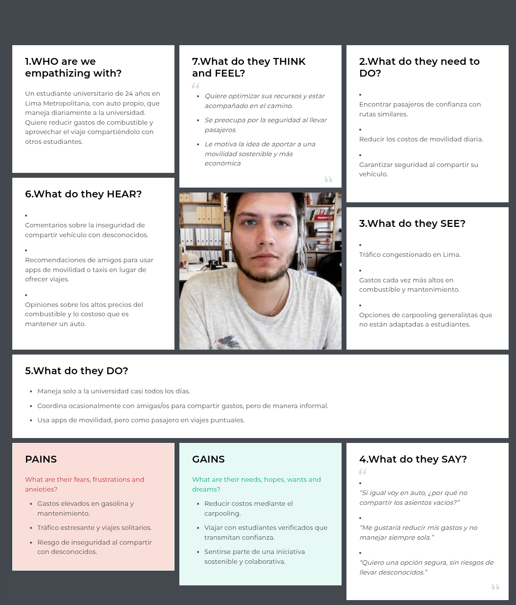

<div align="center">
  
</div>

# <p align="center">Universidad Peruana de Ciencias Aplicadas</p>

### <p align="center">Ingeniería de Software</p>

<p align="center"><strong>Período:</strong> 202520</p>

<p align="center"><strong>1ACC0238 | Aplicaciones para Dispositivos Móviles</strong> </p>
<p align="center"><strong>NRC:</strong>14650</p>
<p align="center"><strong>Docente:</strong>Eduardo Martin Reyes Rodriguez</p>

---

# <p align="center">Informe del Trabajo Final</p>

<p align="center"><strong>Startup:</strong> TinkuyTech</p>
<p align="center"><strong>Producto:</strong> Ñango</p>

<p align="center"><strong>Team members:</strong></p>

<div style="text-align:center;">
    <table align="center">
        <tr>
            <th style="text-align:center;">Código</th>
            <th style="text-align:center;">Integrantes</th>
        </tr>
        <tr>
            <td>U202318814</td>
            <td>Castañeda Llanos, Kevin Alexander</td>
        </tr>
        <tr>
            <td>u202016154</td>
            <td>Gamarra Vega, Anderson Jose</td>
        </tr>
        <tr>
            <td>u202212484</td>
            <td>Grandez Mansilla, Jean Pierre</td>
        </tr>
        <tr>
            <td>U202318814</td>
            <td>Guevara Tejada, Jorge Enrique</td>
        </tr>
        <tr>
            <td>u202113279</td>
            <td>Peña Riofrio, Maria Fernanda</td>
        </tr>
    </table>
</div>


<p align="center"><strong>Diciembre 2025</strong></p>


# Registro de versiones del informe

| Versión | Fecha | Autor | Descripción de Modificación |
| ------- | ----- | ----- | --------------------------- |
| TB1 | 06/09/2025 | TinkuyTech | Redación de los capítulos: <br> Capítulo I: Introducción <br> Capítulo II: Requirements Development and Software Solution Design|
| TB2 | 07/10/2025 | TinkuyTech |  Redación de los capítulos: <br> Capítulo III: Solution UI/UX Design <br> Capítulo IV: Product Implementation & Validation|
| TP | 13/11/2025 | TinkuyTech | Redación de los capítulos: <br> Capítulo IV: Product Implementation & Validation <br> Front-End en Kotlin y Flutter  |
| TF | 04/12/2025 | TinkuyTech | Redación de los capítulos: <br> Capítulo IV: Product Implementation & Validation <br> Finalización del Front-End en Kotlin y Flutter <br> Conexión al backend <br> Conclusiones y Recomendaciones |

# Project Report Collaboration Insights

A continuación, se presenta el proceso seguido para la elaboración del informe en cada entrega, acompañado de capturas de pantalla que evidencian los análisis de colaboración y los registros de commits realizados en GitHub dentro del repositorio correspondiente.

**URL del Repositorio del Informe:** https://github.com/ACC0238-2520-dam-14650-group3/docs

**Link de los repositorios de la organización:** https://github.com/ACC0238-2520-dam-14650-group3

**Entrega N°1: TB1**

- Todos los integrantes del equipo participaron en la elaboración del informe, distribuyendo el trabajo por capítulos específicos. Esta organización permitió un progreso equilibrado y eficiente en su desarrollo.

- Asimismo, se definieron plazos para la culminación de cada capítulo, lo que ayudó a mantener un ritmo constante y ordenado en el avance del proyecto.


*Historial de commits*


*Colaboradores del proyecto en Github*

----

**Entrega N°2: TP**

- Todos los miembros del equipo participaron en diferentes aspectos del entregable. Algunos se encargaron del diseño de la aplicación, otros se enfocaron en la documentación, mientras que una parte del grupo trabajó en el desarrollo del front-end y los demás se responsabilizaron del backend.

- Se establecieron fechas límite para completar cada tarea asignada y, aunque surgieron algunos inconvenientes durante el proceso, el equipo logró superarlos mediante una colaboración efectiva y trabajo conjunto.


*Historial de commits en la documentación, en el fron-end y la landing-page*

**Entrega N°3: TB2**

- Todos los miembros del equipo participaron en diferentes aspectos del entregable. Algunos se encargaron del diseño de la aplicación en kotlin, otros Report, otros se enfocaron en la documentación, mientras que una parte del grupo trabajó en el desarrollo del front-end y los demás se responsabilizaron del backend.

- Se establecieron fechas límite para completar cada tarea asignada y, aunque surgieron algunos inconvenientes durante el proceso, el equipo logró superarlos mediante una colaboración efectiva y trabajo conjunto.


*Historial de commits en la documentación, en el fron-end en flutter y kotlin adempas del backend*

**Entrega N°4: TF**

- - Todos los miembros del equipo participaron en diferentes aspectos del entregable. Algunos se encargaron del diseño de la aplicación en kotlin, otros Report, otros se enfocaron en la documentación, mientras que una parte del grupo trabajó en el desarrollo del front-end y los demás se responsabilizaron del backend.

- Se establecieron fechas límite para completar cada tarea asignada y, aunque surgieron algunos inconvenientes durante el proceso, el equipo logró superarlos mediante una colaboración efectiva y trabajo conjunto.


*Historial de commits en la documentación, en el fron-end en flutter y kotlin adempas del backend*

# Index

### [Capítulo I: Introducción](#capítulo-i-introducción)

- [1.1. Startup Profile](#11-startup-profile)
  - [1.1.1. Descripción de la Startup](#111-descripción-de-la-startup)
  - [1.1.2. Perfiles de integrantes del equipo](#112-perfiles-de-integrantes-del-equipo)
- [1.2. Solution Profile](#12-solution-profile)
  - [1.2.1 Antecedentes y problemática](#121-antecedentes-y-problemática)
  - [1.2.2 Lean UX Process](#122-lean-ux-process)
    - [1.2.2.1. Lean UX Problem Statements](#1221-lean-ux-problem-statements)
    - [1.2.2.2. Lean UX Assumptions](#1222-lean-ux-assumptions)
    - [1.2.2.3. Lean UX Hypothesis Statements](#1223-lean-ux-hypothesis-statements)
    - [1.2.2.4. Lean UX Canvas](#1224-lean-ux-canvas)
- [1.3. Segmentos objetivo](#13-segmentos-objetivo)

### [Capítulo II: Requirements Development and Software Solution Design](#capítulo-ii-requirements-development-and-software-solution-design)

- [2.1. Competidores](#21-competidores)  
  - [2.1.1. Análisis competitivo](#211-análisis-competitivo)  
  - [2.1.2. Estrategias y tácticas frente a competidores](#212-estrategias-y-tácticas-frente-a-competidores)  

- [2.2. Entrevistas](#22-entrevistas)  
  - [2.2.1. Diseño de entrevistas](#221-diseño-de-entrevistas)  
  - [2.2.2. Registro de entrevistas](#222-registro-de-entrevistas)  
  - [2.2.3. Análisis de entrevistas](#223-análisis-de-entrevistas)  

- [2.3. Needfinding](#23-needfinding)  
  - [2.3.1. User Personas](#231-user-personas)  
  - [2.3.2. User Task Matrix](#232-user-task-matrix)  
  - [2.3.3. User Journey Mapping](#233-user-journey-mapping)  
  - [2.3.4. Empathy Mapping](#234-empathy-mapping)  
  - [2.3.5. Ubiquitous Language](#235-ubiquitous-language)  

- [2.4. Requirements specification](#24-requirements-specification)  
  - [2.4.1. User Stories](#241-user-stories)  
  - [2.4.2. Impact Mapping](#242-impact-mapping)  
  - [2.4.3. Product Backlog](#243-product-backlog)  

- [2.5. Strategic-Level Domain-Driven Design](#25-strategic-level-domain-driven-design)  
  - [2.5.1. EventStorming](#251-eventstorming)  
    - [2.5.1.1. Candidate Context Discovery](#2511-candidate-context-discovery)  
    - [2.5.1.2. Domain Message Flows Modeling](#2512-domain-message-flows-modeling)  
    - [2.5.1.3. Bounded Context Canvases](#2513-bounded-context-canvases)  
  - [2.5.2. Context Mapping](#252-context-mapping)  
  - [2.5.3. Software Architecture](#253-software-architecture)  
    - [2.5.3.1. Software Architecture Context Level Diagrams](#2531-software-architecture-context-level-diagrams)  
    - [2.5.3.2. Software Architecture Container Level Diagrams](#2532-software-architecture-container-level-diagrams)  
    - [2.5.3.3. Software Architecture Deployment Diagrams](#2533-software-architecture-deployment-diagrams)  

- [2.6. Tactical-Level Domain-Driven Design](#26-tactical-level-domain-driven-design)  
  - [2.6.x. Bounded Context: <Bounded Context Name>](#26x-bounded-context-bounded-context-name)  
    - [2.6.x.1. Domain Layer](#26x1-domain-layer)  
    - [2.6.x.2. Interface Layer](#26x2-interface-layer)  
    - [2.6.x.3. Application Layer](#26x3-application-layer)  
    - [2.6.x.4. Infrastructure Layer](#26x4-infrastructure-layer)  
    - [2.6.x.5. Bounded Context Software Architecture Component Level Diagrams](#26x5-bounded-context-software-architecture-component-level-diagrams)  
    - [2.6.x.6. Bounded Context Software Architecture Code Level Diagrams](#26x6-bounded-context-software-architecture-code-level-diagrams)  
      - [2.6.x.6.1. Bounded Context Domain Layer Class Diagrams](#26x61-bounded-context-domain-layer-class-diagrams)  
      - [2.6.x.6.2. Bounded Context Database Design Diagram](#26x62-bounded-context-database-design-diagram)  


### [Capítulo III: Solution UI/UX Design](#capítulo-iii-solution-ui/ux-design)

- [3.1. Product design](#31-product-design)
  - [3.1.1. Style Guidelines](#311-style-guidelines)
    - [3.1.1.1. General Style Guidelines](#3111-general-style-guidelines) 
  - [3.1.2. Information Architecture](#312-information-architecture)
    - [3.1.2.1. Organization Systems](#3121-organization-systems)
    - [3.1.2.2. Labelling Systems](#3122-labelling-systems)
    - [3.1.2.3. SEO Tags and Meta Tags](#3123-seo-tags-and-meta-tags)
    - [3.1.2.4. Searching Systems](#3124-searching-systems)
    - [3.1.2.5. Navigation Systems](#3125-navigation-systems)
  - [3.1.3. Landing Page UI Design](#313-landing-page-ui-design)
    - [3.1.3.1. Landing Page Wireframe](#3131-landing-page-wireframe)
    - [3.1.3.2. Landing Page Mock-up](#3132-landing-page-mock-up)
  - [3.1.4. Mobile Applications UX/UI Design](#314-mobile-applications-uxui-design)
    - [3.1.4.1. Mobile Applications Wireframes](#3141-mobile-applications-wireframes)
    - [3.1.4.2. Mobile Applications Wireflow Diagrams](#3142-mobile-applications-wireflow-diagrams)
    - [3.1.4.3. Mobile Applications Mock-ups](#3143-mobile-applications-mock-ups)
    - [3.1.4.4. Mobile Applications User Flow Diagrams](#3144-mobile-applications-user-flow-diagrams)
    - [3.1.4.5. Mobile Applications Prototyping](#3145-mobile-applications-prototyping)a

### [Capítulo IV: Product Implementation & Validation](#capítulo-iv-product-implementation--validation)

- [4. Product Implementation & Validation](#4-product-implementation--validation)
  - [4.1. Software Configuration Management](#41-software-configuration-management)
    - [4.1.1. Software Development Environment Configuration](#411-software-development-environment-configuration)
    - [4.1.2. Source Code Management](#412-source-code-management)
    - [4.1.3. Source Code Style Guide & Conventions](#413-source-code-style-guide--conventions)
    - [4.1.4. Software Deployment Configuration](#414-software-deployment-configuration)
  - [4.2. Landing Page & Mobile Application Implementation](#42-landing-page--mobile-application-implementation)
    - [4.2.1. Sprint 1](#421-sprint-1)
      - [4.2.1.1. Sprint Planning 1](#4211-sprint-planning-1)
      - [4.2.1.2. Sprint Backlog 1](#4212-sprint-backlog-1)
      - [4.2.1.3. Development Evidence for Sprint Review](#4213-development-evidence-for-sprint-review)
      - [4.2.1.4. Testing Suite Evidence for Sprint Review](#4214-testing-suite-evidence-for-sprint-review)
      - [4.2.1.5. Execution Evidence for Sprint Review](#4215-execution-evidence-for-sprint-review)
      - [4.2.1.6. Services Documentation Evidence for Sprint Review](#4216-services-documentation-evidence-for-sprint-review)
      - [4.2.1.7. Software Deployment Evidence for Sprint Review](#4217-software-deployment-evidence-for-sprint-review)
      - [4.2.1.8. Team Collaboration Insights during Sprint](#4218-team-collaboration-insights-during-sprint)
   - [4.2.2. Sprint 2](#422-sprint-2)
      - [4.2.2.1. Sprint Planning 2](#4221-sprint-planning-2)
      - [4.2.2.2. Sprint Backlog 2](#4222-sprint-backlog-2)
      - [4.2.2.3. Development Evidence for Sprint Review](#4223-development-evidence-for-sprint-review)
      - [4.2.2.4. Testing Suite Evidence for Sprint Review](#4224-testing-suite-evidence-for-sprint-review)
      - [4.2.2.5. Execution Evidence for Sprint Review](#4225-execution-evidence-for-sprint-review)
      - [4.2.2.6. Services Documentation Evidence for Sprint Review](#4226-services-documentation-evidence-for-sprint-review)
      - [4.2.2.7. Software Deployment Evidence for Sprint Review](#4227-software-deployment-evidence-for-sprint-review)
      - [4.2.2.8. Team Collaboration Insights during Sprint](#4228-team-collaboration-insights-during-sprint)
    - [4.2.3. Sprint 3](#423-sprint-3)
      - [4.2.3.1. Sprint Planning 3](#4231-sprint-planning-3)
      - [4.2.3.2. Sprint Backlog 3](#4232-sprint-backlog-3)
      - [4.2.3.3. Development Evidence for Sprint Review](#4233-development-evidence-for-sprint-review)
      - [4.2.3.4. Testing Suite Evidence for Sprint Review](#4234-testing-suite-evidence-for-sprint-review)
      - [4.2.3.5. Execution Evidence for Sprint Review](#4235-execution-evidence-for-sprint-review)
      - [4.2.3.6. Services Documentation Evidence for Sprint Review](#4236-services-documentation-evidence-for-sprint-review)
      - [4.2.3.7. Software Deployment Evidence for Sprint Review](#4237-software-deployment-evidence-for-sprint-review)
      - [4.2.3.8. Team Collaboration Insights during Sprint](#4238-team-collaboration-insights-during-sprint)
  - [4.3. Validation Interviews](#43-validation-interviews)
    - [4.3.1. Diseño de Entrevistas](#431-diseño-de-entrevistas)
    - [4.3.2. Registro de Entrevistas](#432-registro-de-entrevistas)
    - [4.3.3. Evaluaciones según heurísticas](#433-evaluaciones-según-heurísticas)


# Student outcome

ABET – EAC - Student Outcome 7

Criterio: La capacidad de adquirir y aplicar nuevos conocimientos según sea necesario, utilizando estrategias de aprendizaje apropiadas.

<table>
  <tr>
    <th class="criterio">Criterio específico</th>
    <th class="acciones">Acciones realizadas</th>
    <th class="conclusiones">Conclusiones</th>
  </tr>

  <!-- Fila 1 -->
  <tr>
    <td>
      Actualiza conceptos y conocimientos necesarios<br>
      para su desarrollo profesional y en especial <br>
      para su proyecto en soluciones de software.
    </td>
    <td>
      <p><b>Gamarra Vega, Anderson José:</b></p>
      <p><b>TB1:</b> Durante la TB1, reforcé mis conocimientos aplicando metodologías de análisis y diseño como Lean UX Process, 5W y 2H, UX Canvas y Hypothesis Statements, lo que permitió estructurar con claridad el Capítulo 1 del proyecto. Este proceso me ayudó a actualizar mis competencias en el planteamiento y diseño inicial de soluciones de software.</p>
      <p><b>TP:</b> En la TP, consolidé habilidades técnicas al elaborar toda la interfaz móvil en Figma, aplicando principios de usabilidad y diseño visual consistente. Esto fortaleció mis capacidades en la creación de interfaces modernas y funcionales, complementando el desarrollo previo realizado en las etapas anteriores.</p>
      <p><b>TB2:</b>En la TB2, profundicé en el desarrollo backend construyendo servicios fundamentales para el proyecto, entre ellos el IAM Service desarrollado en Python con FastAPI. Esta experiencia me permitió actualizar y ampliar significativamente mis conocimientos en arquitectura de servicios, manejo de autenticación, buenas prácticas de API y uso práctico del framework FastAPI.</p>
      <p><b>Castañeda Llanos, Kevin Alexander:</b></p>
      <p><b>TB1:</b> Apoyé en el desarrollo de la documentación del proyecto realizando actividades como los candidate bounded context, entre otros, que permitirían luego entender los componentes y vistas que se necesitaran para la realización de la aplicación móvil</p>
      <p><b>TP:</b>En el Trabajo Parcial me encargué de la realización del backend usando Python + FastAPI, creando el bounded context de reservas para implementarlo en el futuro con la aplicación móvil, ya sea en Kotlin y Jetpack Compose o Flutter y Dart.</p>
      <p><b>TB2:</b>Me encargué de la creación de varias vistas, componentes, pop ups, entre otros, realizando la creación de vistas core del negocio, específicamente para los conductores, creando interfaces para el chat, historial de viajes, crear rutas, los planes de pago de nuestra aplicación, entre otros .</p>
      <p><b>Peña Riofrio, María Fernanda:</b></p>
      <p><b>TB1:</b> Durante la TB1, reforcé mis conocimientos aplicando metodologías como el Lean UX Process y herramientas de análisis (5W y 2H, UX Canvas, Hypothesis Statements), desarrollando el Capítulo 1 del proyecto. Esto me permitió actualizar mis competencias en el diseño y planteamiento de soluciones de software.</p>
      <p><b>TP:</b> En la TP, actualicé mis habilidades en diseño digital al crear toda la interfaz móvil en Figma, aplicando principios de usabilidad y diseño visual coherente. Este proceso fortaleció mis capacidades en la creación de interfaces funcionales y modernas.</p>
      <p><b>TB2:</b>Durante la TB2 consolidé aprendizajes al elaborar el reporte del proyecto y desarrollar vistas iniciales en Flutter para la app móvil. Apliqué principios de diseño de interfaces, estructura de navegación básica y componentes de Material para garantizar legibilidad y coherencia visual. Este trabajo me permitió actualizar conceptos sobre organización de UI, manejo de estados simples y buenas prácticas de código en Dart, además de mejorar mi capacidad para documentar decisiones y alinear el entregable escrito con el avance técnico.</p>
      <p><b>Grandez Mansilla, Jean Pierre:</b></p>
      <p><b>Guevara Tejada, Jorge Enrique:</b></p>
      <p><b>TB1:</b> Durante la TB1, reforcé y actualicé mis conocimientos al introducirme en el desarrollo móvil moderno con Jetpack Compose, comprendiendo su enfoque declarativo, la composición de UI y la gestión del estado. Además, aplicamos herramientas como Uxpressia y Structurizr, lo que me permitió unir el análisis funcional con los fundamentos de la arquitectura de software requerida para apps desarrolladas con Compose. Esta fase fue clave para actualizar mis criterios de diseño y estructura en proyectos móviles.</p>
      <p><b>TP:</b> En la TP, continué profundizando en Jetpack Compose revisando las grabaciones y materiales del curso para asegurar la correcta comprensión de temas como la navegación, ViewModels, estados, recomposición y buenas prácticas. A través de ejercicios y desarrollo del proyecto, actualicé mis conocimientos en la construcción de interfaces modernas y reactivas, mejorando mi capacidad de implementar pantallas funcionales con Kotlin y Compose.</p>
      <p><b>TB2:</b> En la TB2, amplié mis conocimientos migrando al enfoque multiplataforma con Flutter, donde aprendí la estructura del proyecto, el uso de widgets, la administración de estado y el flujo de datos. Esta etapa me permitió actualizar mis competencias técnicas al trabajar con el patrón BLoC, comprender el ciclo de vida en Flutter y adaptarme a un framework con una sintaxis y filosofía distinta a Android nativo, enriqueciendo así mi dominio tecnológico.</p>
    </td>
    <td>
      <p><b>TB1:</b> Como equipo, fortalecimos nuestros conocimientos aplicando diversas herramientas, como Uxpressia para la elaboración de user personas y journey mapping, Structurizr para el desarrollo del modelo C4, además de realizar un análisis de la competencia. Gracias a estas herramientas, logramos diseñar una solución de software más completa, coherente y centrada en las necesidades del usuario.</p>
      <p><b>TP:</b> Durante la TP, fue necesario repasar y revisar las grabaciones de las clases del profesor. Estos recursos resultaron fundamentales para comprender los conceptos y avanzar en el desarrollo del proyecto de manera autónoma.</p>
    </td>
  </tr>

  <!-- Fila 2 -->
  <tr>
    <td>
      Reconoce la necesidad del aprendizaje <br>
      permanente para el desempeño profesional <br>
      y el desarrollo de proyectos en soluciones <br>
      de software.
    </td>
    <td>
      <p><b>Gamarra Vega, Anderson José:</b></p>
      <p><b>TB1:</b> Durante la TB1, reconocí la importancia del aprendizaje continuo al incorporar nuevas metodologías de diseño centradas en el usuario. Esto me motivó a investigar de manera autónoma y actualizar mis conocimientos para mejorar el planteamiento del proyecto desde sus bases.</p>
      <p><b>TP:</b> En la TP, al diseñar por completo la interfaz móvil en Figma, continué aprendiendo mediante la práctica, explorando nuevas herramientas, patrones visuales y recursos avanzados. Esta etapa reafirmó la necesidad de mantener un aprendizaje constante para seguir mejorando y adaptarme a los cambios del desarrollo de software.</p>
      <p><b>TB2:</b>En la TB2, la implementación del IAM Service en Python con FastAPI me impulsó a profundizar en temas como autenticación, seguridad, desarrollo de endpoints y arquitectura limpia. Este reto técnico reforzó mi comprensión de que el aprendizaje permanente es indispensable para adaptarme a la rápida evolución de los entornos backend y para asegurar un desempeño profesional sólido.</p>
      <p><b>Castañeda Llanos, Kevin Alexander:</b></p>
      <p><b>TB1:</b> Aprendí nuevos conceptos como los candidate bounded context que son importantes para la creación de la aplicación y definir posibles funcionalidades que tendrá a futuro la aplicación móvil.</p>
      <p><b>TP:</b> Me encargue de la parte del backend, utilizando tecnologías modernas como FastAPI con el lenguaje de Python, para crear uno de los candidate bounded context del TB1, para posteriormente implementarlo en el Frontend usando Kotlin o Dart.</p>
      <p><b>TB2:</b> Aprendí a más profundidad kotlin con jetpack compose, creando interfaces modernas y que sean atractivas para el usuario, creando pop ups, componentes reutilizables y vistas importantes.</p>
      <p><b>Peña Riofrio, María Fernanda:</b></p>
      <p><b>TB1:</b> Durante la TB1, comprendí la importancia del aprendizaje continuo al aplicar nuevas metodologías de diseño centradas en el usuario. Esto me impulsó a investigar y mejorar mis conocimientos de manera autónoma para el desarrollo del proyecto.</p>
      <p><b>TP:</b> En la TP, el diseño completo de la interfaz móvil en Figma me permitió seguir aprendiendo de forma práctica, explorando nuevas herramientas y recursos. Reafirmé la importancia del aprendizaje constante para adaptarme a los avances en el desarrollo de software.</p>
      <p><b>TP:</b> Para completar estas tareas investigué documentación oficial y recursos técnicos de Flutter/Dart, reforzando un hábito de autoformación continua. Este proceso me ayudó a cerrar brechas técnicas y a planificar mejoras para el siguiente sprint (refinamiento de navegación, accesibilidad y validaciones).</p>
      <p><b>Grandez Mansilla, Jean Pierre:</b></p>
      <p><b>Guevara Tejada, Jorge Enrique:</b></p>
      <p><b>TB1:</b> En la TB1, reconocí la importancia del aprendizaje permanente al enfrentar conceptos nuevos como la programación declarativa y el manejo de estados en Compose. El proceso de investigación, entrevistas y validación nos llevó a comprender que mantenerse actualizado es fundamental para desarrollar soluciones de software que respondan a las necesidades reales del usuario.</p>
      <p><b>TP:</b> Durante la TP, la necesidad de seguir aprendiendo se hizo evidente al trabajar con un entorno nuevo como Android Studio y Jetpack Compose. La búsqueda constante de documentación, tutoriales y recursos oficiales fortaleció mi autonomía y me permitió entender mejor cómo construir una aplicación moderna. Esto reafirmó el valor del aprendizaje continuo para avanzar.</p>
      <p><b>TB2:</b> En la TB2, comprendí aún más la importancia de aprender de manera continua al iniciar el desarrollo con Flutter por primera vez. Fue necesario investigar documentación oficial, explorar ejemplos y resolver problemas técnicos propios del framework. Este proceso reforzó mi compromiso con el aprendizaje permanente y demostró que adaptarse a nuevas tecnologías es esencial para desempeñarse eficazmente en proyectos reales.</p>
    </td>
    <td>
      <p><b>TB1:</b> La implementación de nuevas metodologías y la realización de entrevistas a usuarios nos motivaron a investigar y aprender de manera constante. Este proceso nos ayudó a comprender las necesidades reales del público objetivo y a aplicar estrategias colaborativas, valorando la importancia del aprendizaje continuo en nuestra formación profesional.</p>
      <p><b>TP:</b> Trabajar por primera vez con Android Studio y comprender su estructura de desarrollo representó un reto significativo. No obstante, fue una experiencia enriquecedora que nos permitió descubrir el proceso de creación de una aplicación y familiarizarnos con el lenguaje Kotlin, fortaleciendo nuestras habilidades técnicas.</p>
    </td>
  </tr>
</table>


# Objetivos SMART

<!-- Integrante 1 -->
  <table>
    <tr><th><b>Gamarra Vega, Anderson Jose</b></th></tr>
    <tr>
      <td>
        <p class="objetivo"><b>Objetivo SMART 1:</b></p>
        <p>Desarrollar mi capacidad para construir servicios backend robustos mediante el dominio de Python y FastAPI, completando al menos tres proyectos prácticos —incluyendo APIs con autenticación, manejo de datos y pruebas automatizadas— durante los próximos ocho meses. Con ello, busco afianzar mis habilidades técnicas, ampliar mi portafolio profesional y prepararme para asumir roles más especializados en desarrollo backend.</p>
        <p class="objetivo"><b>Objetivo SMART 2:</b></p>
        <p>Fortalecer mis conocimientos en arquitectura de software y buenas prácticas de desarrollo, estudiando patrones como DDD, Clean Architecture y principios SOLID, y aplicándolos en dos proyectos reales o personales durante los próximos nueve meses. El propósito es mejorar mi capacidad para diseñar sistemas escalables, escribir código mantenible y desempeñarme con mayor solidez en entornos profesionales.</p>
      </td>
    </tr>
  </table>

  <!-- Integrante 2 -->
  <table>
    <tr><th><b>Castañeda Llanos, Kevin Alexander</b></th></tr>
    <tr>
      <td>
        <p class="objetivo"><b>Objetivo SMART 1:</b></p>
        <p>Aprender tecnologías modernas para la creación de aplicaciones móviles usando Kotlin con Jetpack Compose, apoyándose de tecnologías como Shared Preference, Room y SQLite para la gestión de datos, para así formar prototipos e interfaces amigables con el usuario. Usé arquitecturas modernas como MVVM para la organización del código dependiendo de su funcionalidad.</p>
        <p class="objetivo"><b>Objetivo SMART 2:</b></p>
        <p>Desarrollar aplicaciones moviles multiplataformas mediante el uso de Flutter con Dart y el patrón BLoc. Practique en clase y fuera de clase para entender como crear interfaces y utilizarlas en un entorno de trabajo real con el apoyo de arquitecturas de código limpio como lo es BLoC. </p>
      </td>
    </tr>
  </table>

  <!-- Integrante 3 -->
  <table>
    <tr><th><b>Peña Riofrio, Maria Fernanda</b></th></tr>
    <tr>
      <td>
        <p class="objetivo"><b>Objetivo SMART 1:</b></p>
        <p>Fortalecer mis competencias en el desarrollo de aplicaciones móviles, profundizando en el uso de Android Studio y Kotlin mediante la creación de al menos dos proyectos funcionales en un plazo de seis meses después de graduarme, con el fin de dominar la programación de interfaces intuitivas y mantener una práctica constante en entornos reales.</p>
        <p class="objetivo"><b>Objetivo SMART 2:</b></p>
        <p>Desarrollar mis habilidades en diseño UX/UI aplicando herramientas profesionales como Figma, completando dos cursos especializados y elaborando un portafolio digital con al menos cinco prototipos de alta fidelidad en el primer año tras mi titulación, con el propósito de consolidar mi perfil como diseñadora y desarrolladora front-end.</p>
      </td>
    </tr>
  </table>

  <!-- Integrante 4 -->
<table>
  <tr><th><b>Grandez Mansilla, Jean Pierre</b></th></tr>
  <tr>
    <td>
      <p class="objetivo"><b>Objetivo SMART 1:</b></p>
      <p>Profundizar mis conocimientos en arquitectura MVVM y Clean Architecture mediante la práctica constante con Kotlin y Jetpack Compose, dedicándome a mejorar dentro de los primeros seis meses después de graduarme para reforzar buenas prácticas de desarrollo y mantenerme actualizado con las últimas tendencias en desarrollo Android nativo.</p>
      <p class="objetivo"><b>Objetivo SMART 2:</b></p>
      <p>Ampliar mi dominio en desarrollo multiplataforma con Flutter y el patrón BLoC, realizando ejercicios prácticos y explorando diferentes casos de uso durante el primer año tras mi titulación, con el fin de diversificar mis habilidades técnicas y estar preparado para proyectos que requieran soluciones multiplataforma eficientes.</p>
    </td>
  </tr>
</table>

  <!-- Integrante 5 -->
  <table>
    <tr><th><b>Guevara Tejada, Jorge Enrique</b>/th></tr>
    <tr>
      <td>
        <p class="objetivo"><b>Objetivo SMART 1:</b></p>
        <p>Consolidar mis habilidades en el desarrollo Android implementando arquitecturas modernas como MVVM y Clean Architecture. Para ello, me comprometo a crear módulos, prototipos y pequeñas apps con Kotlin y Jetpack Compose de manera continua durante los seis meses posteriores a mi graduación. Este proceso me permitirá fortalecer mi criterio técnico, mejorar la calidad de mis aplicaciones y asegurar un dominio práctico de las buenas prácticas del desarrollo móvil nativo.</p>
        <p class="objetivo"><b>Objetivo SMART 2:</b></p>
        <p>Desarrollar un nivel avanzado en programación multiplataforma mediante el uso de Flutter y el patrón BLoC. Para conseguirlo, dedicaré tiempo semanal a estudiar documentación, resolver ejercicios y construir al menos un proyecto completo dentro del primer año después de obtener mi título. Mi objetivo es ampliar mi versatilidad como desarrollador y estar preparado para afrontar proyectos que demanden soluciones multiplataforma robustas y eficientes.</p>
      </td>
    </tr>
  </table>


# Capítulo I: 
## 1.1  Startup Profile
### 1.1.1. Descripción de la Startup

TinkuyTech es una startup creada por unos estudiantes de la Facultad de Ingeniería de la Universidad Peruana de Ciencias Aplicadas (UPC) con el propósito de responder a una necesidad de la comunidad de estudiantes universitarios: un transporte seguro, accesible y confiable. Observando las dificultades que enfrentan los estudiantes para trasladarse diariamente, desde altos costos en taxis y aplicaciones de movilidad hasta la inseguridad en el transporte informal, ÑanGo propone una solución innovadora que conecta a estudiantes con movilidad propia (choferes) con compañeros que requieren transporte (pasajeros).

Por medio de nuestra plataforma digital, se busca no solo reducir los gastos individuales de transporte, sino también fomentar la confianza, la eficiencia en el desplazamiento y la creación de una comunidad universitaria solidaria. ÑanGo está comprometido con la seguridad, la innovación tecnológica y el impacto social, ofreciendo un modelo colaborativo que mejore la calidad de vida de los estudiantes.

**Misión:**
Nuestra Misión es facilitar el transporte universitario mediante una aplicación accesible y colaborativa que permita a los estudiantes compartir rutas de manera segura, eficiente y económica, priorizando la confianza y la comodidad en cada viaje.

**Visión:**
Nuestra visión es aspirar a ser la plataforma líder en movilidad universitaria en el Perú, reconocida por nuestro compromiso con la seguridad, la sostenibilidad y la experiencia del usuario, contribuyendo a transformar la forma en que los estudiantes se movilizan y fortaleciendo una cultura de transporte compartido responsable.

### 1.1.2. Perfiles de integrantes del equipo

- **Anderson Jose Gamarra Vega:**

**Descripción:** <br>
Mi nombre es Anderson Jose Gamarra Vega, tengo 25 años , estudiante de Ingeniería de Software. Desde siempre he sentido una gran pasión por la tecnología, pero me decanto especialmente por el desarrollo de software, pues me fascina aprender nuevos lenguajes de programación, diseñar soluciones digitales y afrontar retos mediante código. Esta inclinación hacia el software fue lo que me motivó a elegir esta carrera, y actualmente estoy profundizando en áreas como backend, arquitectura de software, metodologías agile.

 

- **Kevin Alexander Castañeda Llanos:**

**Descripción:** <br>

Mi nombre es Kevin Alexander Castañeda Llanos, tengo 19 años y soy estudiante de la carrera de Ingeniería de Software. Siempre me gusto la tecnología y senti curiosidad por aprender en como funcionaba la creacióna de aplicaciones o paginas web. Esta fue mi principal inspiración para estudiar algo relacionado al TI. Además, me gustó la idea de desarrollar proyectos y diseñar soluciones que ayuden a solucionar problemas de los demás con ayuda de las personas.


- **Maria Fernanda Peña Riofrio:**

**Descripción:** <br>
Mi nombre es Maria Fernanda Peña Riofrio, tengo 21 años y soy estudiante de la carrera de Ingeniería de Software cursando el 7mo ciclo. Elegí la carrerra por que siempre me ha gustado descubrir nuevas tecnologías y como se creaban y configuraban. En un futuro me gusatría dedicarme a la creación de desarrollo web y mobile que solución problemas de la vida real.


- **Jorge Enrique Guevara Tejada:**

**Descripción:** <br>
Mi nombre es Jorge Enrique Guevara Tejada, soy un estudiante que se caracteriza por su alto sentido de la responsabilidad y un fuerte compromiso con su equipo. Me esfuerzo continuamente por superar los desafíos académicos, dedicando tiempo adicional a mejorar en las áreas donde siento que puedo crecer. Mi objetivo no es sólo alcanzar un rendimiento académico satisfactorio, sino también contribuir de manera significativa al éxito del equipo, asegurando que cada proyecto en el que participó refleja nuestro esfuerzo y dedicación colectivos.

 

- **Jean Pierre Grandez Mansilla:**
**Descripción:** <br>
- Mi nombre es Jean Pierre Grandez Mansilla, tengo 21 años y soy estudiante de Ingeniería de Software, actualmente en mi 7mo ciclo. Me gusta la programación, pero sobre todo me interesa entender cómo funcionan realmente las cosas detrás de cada tecnología. Últimamente me enfoco en aprender sobre cloud, serverless y también me llama la atención el desarrollo móvil. Además, la música es una parte importante de mi día a día.
## 1.2. Solution Profile
En esta sección se abordará el perfil de la solución teniendo en cuenta el problema y las ideas que se deben resolver para fomentar la seguridad de los estudiantes.

### 1.2.1 Antecedentes y problemática

La inseguridad en los medios de transporte ha aumentado significativamente en el Perú, afectando tanto a los conductores como a los pasajeros. Este problema se acrecienta en el caso de los estudiantes universitarios, quienes muchas veces son víctimas de robos y asaltos, especialmente en zonas cercanas a sus centros de estudio. Asimismo, la extorsión a transportistas por el cobro de "cupos" limita la disponibilidad de servicios seguros, generando temor y restringiendo la libertad de movilización.


Dada las circunstancias, surge la necesidad de una solución tecnológica que permita a los estudiantes movilizarse con mayor confianza y seguridad. Es en este contexto que se propone **ÑanGo**, una aplicación móvil de transporte compartido orientada exclusivamente a la comunidad estudiantil. Esta solución facilita que los estudiantes que cuentan con movilidad propia puedan compartir sus rutas con otros compañeros, optimizando costos, ofreciendo mayor tranquilidad en los desplazamientos y reduciendo los riesgos de inseguridad mediante medidas de protección integradas en la plataforma.

### Problemática (5Ws y 2Hs)

**WHAT**

***¿Cuál es el problema?***

Los servicios de transporte actuales en el Perú presentan serias deficiencias en materia de seguridad. Robos, asaltos y extorsiones a conductores son frecuentes, exponiendo a los estudiantes a situaciones de riesgo. Esto ha generado desconfianza y una necesidad urgente de contar con un servicio de transporte confiable, seguro y accesible.

***¿Cuál es la relación con los estudiantes?***

Este problema impacta directamente en los universitarios, quienes necesitan trasladarse a sus centros de estudio de manera segura y económica. La falta de opciones adecuadas genera estrés, miedo y limita su libertad de movilidad.

**WHEN**

***¿Cuándo sucede el problema?***

El problema ocurre diariamente en las calles de Lima, especialmente en los horarios de entrada y salida de las universidades. Estos momentos coinciden con horas punta, cuando el tráfico es intenso y las zonas cercanas a los campus se convierten en puntos críticos para la delincuencia.

***¿Cuándo utilizan nuestra aplicación los estudiantes?***

Los usuarios emplearán la aplicación principalmente antes de sus clases, para programar y coordinar viajes compartidos con otros estudiantes verificados, reduciendo tiempos de espera y optimizando su movilidad diaria.

**WHERE**

***¿Dónde está el cliente cuando usa el producto?***

Los estudiantes acceden a ÑanGo desde sus hogares, universidades u otros lugares con conexión a internet, para coordinar viajes y planificar sus rutas de manera anticipada.


***¿A dónde se dirige?***

El cliente utiliza ÑanGo principalmente para dirigirse hacia y desde su universidad, aunque la aplicación también permite coordinar rutas relacionadas con su vida estudiantil (por ejemplo, actividades extracurriculares o prácticas profesionales).


***¿Dónde surge el problema?***

El problema se origina en las calles y avenidas de Lima y otras ciudades universitarias, donde predominan el transporte informal, la congestión y la inseguridad, generando un entorno riesgoso para los estudiantes.


**WHO**

***¿Quiénes están involucrados? ¿Quién lo utilizará?***

Los principales involucrados son los estudiantes universitarios, quienes pueden participar como pasajeros o conductores. Los conductores (con movilidad propia) buscan compartir viajes y reducir costos, mientras que los pasajeros necesitan una alternativa segura para llegar a sus universidades.

También se consideran involucrados los familiares de los estudiantes, quienes podrían ocasionalmente brindar transporte seguro a compañeros de sus hijos, fomentando la confianza dentro de la comunidad académica.

**WHY**

***¿Cuál es la causa del problema?***

La principal causa es la falta de un sistema de transporte seguro, regulado y confiable para los estudiantes universitarios. La informalidad en el servicio de taxis, la insuficiente presencia policial en zonas críticas y la ausencia de tecnología que facilite la coordinación de viajes seguros agravan el problema. Además, los altos costos del transporte privado hacen que muchos jóvenes opten por alternativas más económicas, aunque menos seguras.

**HOW**

***¿Cómo usan los estudiantes nuestra aplicación?***

Los usuarios emplearán la aplicación móvil en condiciones de alta demanda (horas punta o zonas inseguras). A través de ella podrán coordinar sus rutas, ahorrar dinero al compartir gastos y movilizarse con la confianza de hacerlo junto a otros estudiantes verificados.

***¿Cómo se conoce nuestra aplicación?***

ÑanGo será conocido inicialmente mediante campañas digitales en redes sociales y a través de recomendaciones entre estudiantes. La aplicación ofrecerá notificaciones instantáneas, coordinación de gastos y validación de perfiles como principales diferenciadores.

**HOW MUCH**

***¿Cuál es la magnitud del problema?***

En Lima y Callao, el cobro de cupos por bandas criminales al transporte urbano formal representa una carga económica significativa. Se estima que más de S/ 10 millones mensuales salen del sector transporte para pagar extorsiones a estas mafias. (Infobae, 2025). 

Cerca del 80 % de las empresas formales de transporte urbano están afectadas por este cobro.
En algunos casos específicos, los choferes deben pagar entre S/ 5 y S/ 10 soles por cada vuelta que realizan los buses, lo cual al acumularse entre muchas unidades y rutas supone pérdidas mensuales elevadas.(Exitosa, 2025)

Además del factor económico, la inseguridad se ve agravada por amenazas, asesinatos de transportistas y extorsiones físicas o con daño a la propiedad cuando los pagos no se efectúan. (Infobae, 2025).

### 1.2.2. Lean UX Process

La metodología Lean UX se enfoca en el usuario y en la validación constante de soluciones frente a una problemática. Tras identificar la necesidad, consideramos adecuado aplicar esta metodología para diseñar una solución que sea relevante y efectiva.

#### 1.2.2.1 Lean UX Problem Statements

La inseguridad ciudadana en el Perú, especialmente en Lima, ha convertido el transporte diario en una experiencia de alto riesgo para los estudiantes universitarios, quienes enfrentan robos, asaltos y extorsiones de manera constante. La ausencia de un sistema de movilidad seguro, confiable y accesible los obliga a optar entre alternativas costosas o arriesgadas, afectando su calidad de vida y su tranquilidad.

Ante este contexto, surge la necesidad de una solución tecnológica que permita a los estudiantes trasladarse de manera segura y económica, compartiendo rutas y gastos con compañeros verificados. El desafío es diseñar una plataforma móvil que promueva confianza, optimice los desplazamientos y brinde protección a la comunidad universitaria en su día a día.

### Aspectos

**Domain:**

Movilidad urbana y seguridad ciudadana aplicada a estudiantes universitarios en contextos urbanos del Perú.

**Customer Segments**

- **Estudiantes Universitarios sin vehículo propio**
  
  Jóvenes que necesitan desplazarse diariamente a sus universidades y enfrentan desafíos como inseguridad en el transporte público, costos elevados y estrés en sus trayectos.


- **Estudiantes con vehículo privado**

  Propietarios de autos que desean compartir sus viajes con compañeros de confianza para reducir gastos en combustible, aumentar la seguridad en sus trayectos y aprovechar de forma más eficiente el uso del vehículo.

**Pain Points**

- **Estudiantes sin vehículo propio**

  - **Inseguridad:** Exposición constante a robos y asaltos en transporte público e informal.

  - **Costo elevado:** Gastos recurrentes en transporte privado (taxis, aplicativos) que no siempre garantizan seguridad.

  - **Estrés y desconfianza:** Desplazamientos que generan ansiedad e incertidumbre, afectando su bienestar y rendimiento académico.

- **Estudiantes con vehículo privado**

  - **Bajo aprovechamiento del vehículo:** Viajes realizados con asientos vacíos que generan gastos innecesarios en combustible.

  - **Falta de confianza:** Dificultad para identificar compañeros confiables con quienes compartir el viaje.

**Gap**

Actualmente no existe una solución tecnológica orientada específicamente a estudiantes universitarios que combine seguridad, accesibilidad y economía en el transporte compartido. Las aplicaciones de movilidad disponibles no contemplan mecanismos de verificación entre pares ni se adaptan a los horarios y necesidades académicas.

**Vision / Strategy**

Diseñar e implementar una aplicación móvil de carpooling enfocada en estudiantes universitarios, que permita:

- Conectar a compañeros verificados mediante la universidad.
- Compartir rutas de forma segura y transparente.
- Reducir costos de transporte, optimizando el uso de los vehículos disponibles.
- Fomentar un entorno de confianza, protección y accesibilidad en la movilidad diaria.

**Initial Segment**

Estudiantes universitarios de Lima Metropolitana, especialmente en zonas con mayor incidencia de inseguridad y demanda de transporte compartido.

#### 1.2.2.2. Lean UX Assumptions

**User Assumptions**

1. **¿Quién es el usuario?**

    El usuario es cualquier estudiante universitario (como pasajero o conductor) que busca una alternativa segura, económica y confiable para movilizarse hacia su universidad. También incluye a estudiantes con vehículo propio interesados en compartir sus viajes y reducir gastos.

2. **¿Dónde encaja nuestro producto en su vida?**
 
    En su rutina diaria de desplazamiento hacia y desde la universidad. La app móvil se integra como una herramienta práctica y rápida que sustituye el transporte inseguro o costoso, especialmente en horas pico y zonas de riesgo.
3. **¿Qué problemas debe resolver nuestro producto?**

  - La inseguridad en el transporte público e informal.
  - Los costos elevados de taxis y aplicativos.
  - La falta de confianza al compartir viajes con desconocidos
  - La ineficiencia en la coordinación de horarios y rutas.


4. **¿Cuándo y cómo se usa el producto?**

    La aplicación se utiliza principalmente en las mañanas y tardes, al coordinar viajes hacia y desde la universidad. Los estudiantes ingresan su ruta y horario en la app, que los conecta con compañeros verificados que tengan trayectos similares.

5. **¿Qué características son importantes?**

  - Verificación de identidad con credencial universitaria.
  - Calificación y comentarios entre usuarios.
  - Sistema de gastos compartidos.
  - Visualización de rutas seguras y recomendadas.
  - Chat interno entre pasajeros y conductores.
  - Notificaciones en tiempo real sobre cambios de viaje.

6. **¿Cómo debe verse y comportarse el producto?**

    La aplicación debe ser juvenil, intuitiva y confiable, con diseño simple y botones de acción rápida. Debe cargar rápido, enviar notificaciones claras y transmitir seguridad mediante íconos visibles de verificación, soporte de emergencia y rutas validadas.

**Business Assumptions**

- Creemos que los estudiantes necesitan una aplicación móvil que les permita compartir viajes de manera segura, económica y confiable, con usuarios verificados de su propia universidad.

- Esta necesidad se puede cubrir con una app que integre: validación universitaria, rutas seguras, reparto automático de gastos y funciones de emergencia.

- El principal valor que los clientes esperan es seguridad en sus traslados, seguida de accesibilidad económica y confianza entre usuarios.

- La adquisición de usuarios se logrará a través de campañas digitales en redes sociales, difusión en campus universitarios y convenios con universidades.

- La competencia directa son taxis y aplicaciones de movilidad (Uber, InDrive, Cabify), que no ofrecen exclusividad ni seguridad universitaria.

- Superaremos a la competencia ofreciendo una comunidad cerrada de estudiantes verificados, viajes compartidos y opciones de seguridad en ruta.

- El mayor riesgo es la desconfianza inicial de los usuarios en compartir viajes.

- Este riesgo se mitigará mediante: perfiles verificados, sistema de calificaciones, protocolos de emergencia, soporte en tiempo real y retroalimentación constante.

- La confianza aumentará con el tiempo a medida que los usuarios vivan experiencias seguras y compartan reseñas positivas.

- La satisfacción se reforzará con incentivos (recompensas por uso frecuente) y mejoras continuas del sistema.

#### 1.2.2.3 Lean UX Hypothesis Statements

1. **Optimización de tiempo y costos**

**Creemos que** los estudiantes podrán optimizar su tiempo y reducir costos de transporte si implementamos una funcionalidad que les permita coordinar viajes en grupo con compañeros de su misma universidad.

**Sabremos que** hemos tenido éxito cuando al menos el **30 % de los estudiantes utilicen regularmente la plataforma** para coordinar viajes y un **25 % reporte una disminución en sus gastos de transporte mensual.**

2. **Sostenibilidad y reducción de huella de carbono**

**Creemos que** los estudiantes contribuirán a la sostenibilidad y reducirán su huella de carbono si les ofrecemos una opción sencilla para coordinar viajes compartidos, disminuyendo el número de autos individuales en rutas comunes hacia las universidades.

**Sabremos que** hemos tenido éxito cuando al menos el 20 % de los estudiantes reporten haber preferido compartir vehículo en lugar de usar transporte público o privado.


3. **Seguridad y confianza en los traslados**

**Creemos que** los estudiantes mejorarán su accesibilidad y seguridad en los traslados si incluimos un sistema de calificación y seguimiento de viajes compartidos que genere mayor confianza y control.

**Sabremos que** hemos tenido éxito cuando al menos el 15 % de los usuarios reporten mayor confianza y comodidad al usar la plataforma, y un 20 % afirme que el sistema de calificación ha mejorado su experiencia de viaje.

4. **Verificación de identidad y afinidad**

**Creemos que** los estudiantes estarán más dispuestos a utilizar la plataforma si esta ofrece perfiles verificados y filtros de coincidencia por universidad o facultad.

**Sabremos que** hemos tenido éxito cuando al menos el 60 % de los usuarios activen la verificación de identidad y un 70 % prefiera viajar con contactos verificados de su misma institución.

5. **Notificaciones y puntualidad**

**Creemos que** la adopción de la plataforma aumentará si se integra un sistema de notificaciones para viajes programados.

**Sabremos que** hemos tenido éxito cuando el 80 % de los trayectos se confirmen con más de 6 horas de anticipación y se logre una reducción del 30 % en cancelaciones de último minuto.

6. **Pagos digitales y gestión de gastos**

**Creemos que** la plataforma será más atractiva si permite compartir gastos automáticamente mediante un sistema de pagos digitales integrado.

**Sabremos que** hemos tenido éxito cuando al menos el 50 % de los viajes registrados utilicen el sistema de pago integrado y el 85 % de los usuarios lo califiquen como fácil y seguro.

#### 1.2.2.4. Lean UX Canvas


## 1.3. Segmentos objetivo

### Segmento 1: Estudiantes con vehículo

**Características Demográficas**

- **Edad:** 18 años a más
- **Nacionalidad:** Peruana
- **Ubicación:** Áreas urbanas (principalmente Lima Metropolitana y ciudades universitarias)
- **Nivel educativo:** Estudiantes universitarios
- **Intereses:** Uso eficiente del vehículo, ahorro en combustible, opciones de estacionamiento seguro, comodidad en sus desplazamientos.

**Características Psicográficas**

- Estudiantes que poseen un vehículo propio y están dispuestos a compartirlo para reducir costos de transporte.
- Valoran aplicaciones móviles que les permitan coordinar viajes en tiempo real, con recordatorios y notificaciones sobre horarios y pasajeros.
- Buscan comodidad y confianza al viajar con compañeros verificados dentro de la comunidad universitaria.
- Ven la plataforma como una forma de generar ingresos adicionales o cubrir parcialmente gastos de movilidad.

### Segmento 2: Estudiantes sin vehículo

**Características Demográficas**

- Edad: Desde los 16 años en adelante
- Nacionalidad: Peruana
- Ubicación: Áreas urbanas (zonas con alta concentración de universidades)
- Nivel educativo: Principalmente estudiantes de universidades e institutos.
- Intereses: Transporte seguro, accesible, puntual y confiable.

**Características Psicográficas**

- Estudiantes que no cuentan con un vehículo propio o desean reducir sus gastos de transporte.
- Prefieren soluciones móviles que les permitan reservar viajes fácilmente, recibir alertas de salida y confirmar rutas en pocos pasos.
- Buscan seguridad a través de perfiles verificados y sistemas de calificación de conductores y pasajeros.
- Valoran la conveniencia de coordinar viajes desde el celular sin depender de alternativas riesgosas o costosas.

# Capítulo II: Requirements Development and Software Solution Design
## 2.1. Competidores

Se han identificado los siguientes competidores en el mercado de soluciones de movilidad colaborativa y carpooling para estudiantes universitarios y usuarios urbanos:

- Competidor 1: EnRuta (PUCP)

Descripción: Plataforma universitaria que conecta a estudiantes de la PUCP para crear “salas de viaje” según puntos de partida y destino. No gestiona pagos, su foco es la seguridad y la confianza entre miembros de la comunidad educativa.

- Competidor 2: inDrive (Peer-to-Peer)

Descripción: App internacional de ride-hailing que permite la negociación directa entre conductores y pasajeros. Aunque no está orientada exclusivamente a estudiantes, es un referente en movilidad colaborativa bajo un modelo peer-to-peer, con presencia en múltiples ciudades.

- Competidor 3: BlaBlaCar (Carpooling Global)

Descripción: Plataforma líder en carpooling a nivel global. Conecta conductores con pasajeros que comparten trayectos de media y larga distancia. Su foco es la optimización de costos y la sostenibilidad, consolidándose como el ejemplo más avanzado de carpooling digital.

### 2.1.1. Análisis competitivo


| Competitive Analysis Landscape        |                                                                                                                                                                                                                                                                                                                                                                                                                      |
|---------------------------------------|----------------------------------------------------------------------------------------------------------------------------------------------------------------------------------------------------------------------------------------------------------------------------------------------------------------------------------------------------------------------------------------------------------------------|
| ¿Por qué llevar a cabo este análisis? | Este análisis nos permite identificar competidores con distintos grados de madurez en el ecosistema de movilidad colaborativa: desde iniciativas universitarias locales hasta plataformas globales de carpooling.<br/>De esta forma podemos contrastar nuestra propuesta con alternativas existentes, posicionándonos como una opción intermedia enfocada en **seguridad, comunidad universitaria y accesibilidad**. |


|                         |                             | **Nuestra Startup(ÑanGO)**                                                                                            | **EnRuta (PUCP)**                                                | **inDrive (Peer-to-Peer)**                                                               | **BlaBlaCar (Carpooling Global)**                                                 |
|-------------------------|-----------------------------|-----------------------------------------------------------------------------------------------------------------------|------------------------------------------------------------------|------------------------------------------------------------------------------------------|-----------------------------------------------------------------------------------|
| **PERFIL**              | Overview                    | App universitaria de carpooling que conecta **estudiantes conductores y pasajeros** de una misma comunidad académica. | App universitaria PUCP para compartir rutas entre estudiantes.   | App global peer-to-peer donde conductor y pasajero **negocian el precio** de cada viaje. | Plataforma global de carpooling que conecta viajes de media/larga distancia.      |
| **PERFIL**              | Ventaja competitiva (valor) | **Seguridad + Comunidad**: usuarios verificados como estudiantes + confianza entre pares.                             | Exclusividad universitaria y foco en seguridad.                  | Flexibilidad en negociación de precios y gran disponibilidad.                            | Alcance internacional, amplia base de usuarios y trayectoria consolidada.         |
| **Perfil de Marketing** | Mercado objetivo            | Estudiantes universitarios de Lima y posteriormente de LatAm.                                                         | Estudiantes de la PUCP.                                          | Usuarios urbanos globales que buscan transporte económico y flexible.                    | Viajeros interurbanos y de larga distancia en todo el mundo.                      |
| **Perfil de Marketing** | Estrategia de marketing     | Difusión universitaria, convenios institucionales, marketing digital en campus.                                       | Comunicación interna de la universidad, canales institucionales. | Marketing masivo con foco en ahorro y flexibilidad.                                      | Marketing global con casos de éxito y enfoque en sostenibilidad.                  |
| **Perfil de Producto**  | Productos & servicios       | App móvil con reservas de asientos, validación de identidad y pagos integrados.                                       | App móvil básica con salas de viaje y sin gestión de pagos.      | App móvil con negociación de tarifas, geolocalización y sistema de reputación.           | App y web con planificación de viajes, reservas, pagos y sistema de calificación. |
| **Perfil de Producto**  | Precios & costos            | Modelo accesible: costo compartido con tarifa base universitaria.                                                     | Gratuita (sin monetización).                                     | Precios variables según negociación entre conductor y pasajero.                          | Tarifa definida por el conductor; comisión por uso de plataforma.                 |
| **Perfil de Producto**  | Canales (Web/Móvil)         | App móvil + web de soporte, con foco en comunidad universitaria.                                                      | App móvil interna PUCP.                                          | App móvil (iOS/Android).                                                                 | App móvil y sitio web global.                                                     |
| **Análisis SWOT**       | Fortalezas                  | Comunidad universitaria cerrada, seguridad, accesibilidad económica.                                                  | Exclusividad universitaria, percepción de seguridad.             | Flexibilidad en tarifas, presencia internacional.                                        | Amplia base de usuarios, trayectoria global, confianza en marca.                  |
| **Análisis SWOT**       | Debilidades                 | Recursos limitados, crecimiento dependiente de convenios con universidades.                                           | Limitado a una sola universidad, sin modelo de monetización.     | Riesgo de inseguridad al negociar con desconocidos.                                      | Poco enfoque en estudiantes y viajes cortos urbanos.                              |
| **Análisis SWOT**       | Oportunidades               | Escalar a otras universidades, integrar funciones de pago y reputación, crecer en LatAm.                              | Expandirse a otras universidades.                                | Captar estudiantes como nuevo segmento objetivo.                                         | Expandirse hacia viajes urbanos cortos y convenios con universidades.             |
| **Análisis SWOT**       | Amenazas                    | Entrada de apps globales al nicho universitario, resistencia cultural al carpooling.                                  | Dependencia de políticas internas de la universidad.             | Competencia con taxis tradicionales y ride-hailing.                                      | Competidores emergentes más especializados en nichos como estudiantes.            |

### 2.1.2. Estrategias y tácticas frente a competidores

Para fortalecer nuestra propuesta frente a los competidores identificados, se plantean las siguientes estrategias y tácticas:

- Diferenciación por Seguridad y Comunidad
  - Implementar un sistema de verificación obligatoria de identidad universitaria (carné, correo institucional).
  - Potenciar el sentido de pertenencia y confianza al limitar la plataforma a estudiantes. 

- Enfoque en Universidades y Jóvenes 
  - Establecer convenios con universidades para promover la app dentro de campus. 
  - Posicionar la solución como una alternativa económica, segura y confiable frente al transporte público y ride-hailing.

- Escalabilidad Regional 
  - Comenzar en Lima con universidades privadas y públicas estratégicas. 
  - Expandir posteriormente a otras ciudades de Latinoamérica con fuerte concentración universitaria.

- Valor agregado en la experiencia de usuario 
  - Pagos integrados y transparentes dentro de la app. 
  - Funciones de reputación (calificaciones, reseñas) para generar confianza. 
  - Incentivos para conductores (reducción de costos de combustible, beneficios por viajes frecuentes).

## 2.2. Entrevistas.

En esta sección se detallan las entrevistas realizadas a los segmentos objetivo identificados previamente, con el fin de comprender mejor sus necesidades, comportamientos y expectativas respecto a soluciones de monitoreo de cadena de frío en el sector salud.
### 2.2.1. Diseño de entrevistas.

Se han diseñado entrevistas semiestructuradas para dos segmentos objetivo principales, con el objetivo de profundizar con sus necesidades y validar nuestras hipótesis iniciales.

- **Segmento 1: Estudiantes con vehículo**
  -  **Objetivo:** Entender sus motivaciones para compartir viajes, preocupaciones sobre seguridad y expectativas de una plataforma de carpooling.

**Preguntas para el Segmento 1: Estudiantes con vehículo**
    
1. ¿Con qué frecuencia utilizas tu vehículo para ir a la universidad?
2. ¿Cuánto gastas aproximadamente al mes en combustible y estacionamiento?
3. ¿Qué opinas sobre compartir tu vehículo con otros estudiantes?
4. ¿Qué incentivo te motivaría más a ofrecer viajes compartidos? (ej. reducción de costos, compañía, recompensas).
5. ¿Qué tan importante sería para ti contar con un sistema de calificaciones o validación de pasajeros?
6. ¿Qué tipo de compensación esperarías recibir por ofrecer un asiento (dinero, beneficios, descuentos, etc.)?
7. ¿Qué funcionalidades crees que debería tener una aplicación que te ayude a organizar tus viajes compartidos?
8. ¿Qué tan cómodo te sentirías coordinando viajes con pasajeros mediante una app?
9. ¿Qué preocupaciones tendrías al transportar a otros estudiantes? (ej. seguridad, puntualidad, responsabilidad legal).
10. ¿Qué condiciones deberían cumplirse para que realmente ofrezcas tu auto?

- **Segmento 2: Estudiantes sin vehículo**
  - **Objetivo:** Identificar sus principales desafíos de movilidad, criterios para elegir transporte y disposición a usar una app de carpooling.

**Preguntas para el Segmento 2: Estudiantes sin vehículo**

1. ¿Qué medio de transporte utilizas actualmente para ir a la universidad?
2. ¿Qué aspectos te incomodan más de tu medio de transporte actual? (ej. tiempo, seguridad, costos, comodidad).
3. ¿Cuánto tiempo promedio tardas en llegar a la universidad?
4. ¿Cuánto gastas semanalmente en transporte?
5. ¿Qué tan dispuesto estarías a compartir un viaje con otros estudiantes de tu universidad? ¿Por qué? 
6. ¿Qué beneficios esperarías obtener al usar un servicio de carpooling entre estudiantes? 
7. ¿Qué tan importante es para ti la seguridad al usar un servicio de transporte compartido? 
8. ¿Preferirías un servicio más económico aunque tarde un poco más, o pagar más por ahorrar tiempo?
9. ¿Con qué frecuencia utilizas aplicaciones móviles para tus actividades diarias? 
10. ¿Qué características valoras más en una aplicación de transporte (ej. facilidad de uso, rapidez, métodos de pago, calificaciones de usuarios)?
11. ¿Qué te generaría dudas o desconfianza al usar una plataforma de carpooling con otros estudiantes?
12. ¿Qué condiciones deberían cumplirse para que realmente decidas usar un servicio de carpooling?

### 2.2.2. Registro de entrevistas

- **Segmento 1: Estudiantes con vehículo**

Nombre: Maria Pilares
Edad: 23 años
Universidad: Universidad Peruana de Ciencias Aplicadas (UPC)
Carrera: Ingeniería de Software

[Entrevista Maria Pilares](https://upcedupe-my.sharepoint.com/:v:/g/personal/pcsierey_upc_edu_pe/EfqMxusZwpxCtOOdNQogo8UB-QCBgiuyAeFFA3gOB-ksXQ?nav=eyJyZWZlcnJhbEluZm8iOnsicmVmZXJyYWxBcHAiOiJPbmVEcml2ZUZvckJ1c2luZXNzIiwicmVmZXJyYWxBcHBQbGF0Zm9ybSI6IldlYiIsInJlZmVycmFsTW9kZSI6InZpZXciLCJyZWZlcnJhbFZpZXciOiJNeUZpbGVzTGlua0NvcHkifX0&e=LWucCn) 

Resumen de la entrevista: María actualmente utiliza su vehículo personal para ir a la universidad, lo que le permite mayor comodidad y flexibilidad en sus horarios. Sin embargo, reconoce que los costos asociados al combustible y estacionamiento son elevados, gastando aproximadamente 300 soles mensuales en estos conceptos.
Está abierta a la idea de compartir su vehículo con otros estudiantes, siempre y cuando exista un sistema de verificación y calificación que le brinde confianza. Valora mucho la seguridad y preferiría contar con una plataforma que le permita coordinar viajes de manera sencilla y segura. Además, considera que recibir algún tipo de compensación económica o beneficios adicionales sería un incentivo importante para ofrecer viajes compartidos.


- **Segmento 2: Estudiantes sin vehículo**

Nombre: Huber Antonio Requejo
Edad: 22 años
Universidad: Universidad Pontificia Católica del Perú (PUCP)
Carrera: Economía

[Entrevista Huber Antonio](https://upcedupe-my.sharepoint.com/:v:/g/personal/pcsierey_upc_edu_pe/EfqMxusZwpxCtOOdNQogo8UB-QCBgiuyAeFFA3gOB-ksXQ?nav=eyJyZWZlcnJhbEluZm8iOnsicmVmZXJyYWxBcHAiOiJPbmVEcml2ZUZvckJ1c2luZXNzIiwicmVmZXJyYWxBcHBQbGF0Zm9ybSI6IldlYiIsInJlZmVycmFsTW9kZSI6InZpZXciLCJyZWZlcnJhbFZpZXciOiJNeUZpbGVzTGlua0NvcHkifX0&e=LWucCn)

Resumen de la entrevista: Huber nos comenta que normalmente utiliza el transporte público para ir a la universidad debido a que reside lejos del campus. Sin embargo, ha experimentado situaciones de inseguridad y robos en varias ocasiones, lo que le genera preocupación. Tarda aproximadamente 1 hora y 30 minutos en llegar a la universidad y gasta alrededor de 70 soles semanales en transporte.
Además, Huber nos comenta que normalmente los taxis de aplicativos no todos suelen ser personas confiables, y que prefiere no usarlos a menos que sea una emergencia. Está bastante dispuesto a compartir un viaje con otros estudiantes, ya que considera que esto podría reducir sus costos y mejorar la seguridad al viajar con personas conocidas. Valora mucho la seguridad en un servicio de transporte compartido y preferiría pagar un poco más si eso significa llegar más rápido y seguro.


Nombre: Eduardo Ventura
Edad: 22 años
Universidad: Universidad Peruana de Ciencias Aplicadas (UPC)
Carrera: Ingeniería de Software

[Entrevista Eduardo Ventura](https://upcedupe-my.sharepoint.com/:v:/g/personal/pcsierey_upc_edu_pe/EfqMxusZwpxCtOOdNQogo8UB-QCBgiuyAeFFA3gOB-ksXQ?nav=eyJyZWZlcnJhbEluZm8iOnsicmVmZXJyYWxBcHAiOiJPbmVEcml2ZUZvckJ1c2luZXNzIiwicmVmZXJyYWxBcHBQbGF0Zm9ybSI6IldlYiIsInJlZmVycmFsTW9kZSI6InZpZXciLCJyZWZlcnJhbFZpZXciOiJNeUZpbGVzTGlua0NvcHkifX0&e=LWucCn)

Resumen de la entrevista: Eduardo nos comenta que actualmente utiliza el transporte público para ir a la universidad, lo cual le genera incomodidad debido a la falta de seguridad y la congestión en las horas punta. Tarda aproximadamente una hora en llegar a la universidad y gasta alrededor de 70 soles semanales en transporte.
Está bastante dispuesto a compartir un viaje con otros estudiantes, ya que considera que esto podría reducir sus costos y mejorar la seguridad al viajar con personas conocidas. Valora mucho la seguridad en un servicio de transporte compartido y preferiría pagar un poco más si eso significa llegar más rápido y seguro.

Nombre: Sebastian Arevalo
Edad: 20 años
Universidad: Universidad San Martín de Porres (USMP)
Carrera: Ingeniería de Software

[Entrevista Sebastian Arevalo](https://upcedupe-my.sharepoint.com/:v:/g/personal/pcsierey_upc_edu_pe/EfqMxusZwpxCtOOdNQogo8UB-QCBgiuyAeFFA3gOB-ksXQ?nav=eyJyZWZlcnJhbEluZm8iOnsicmVmZXJyYWxBcHAiOiJPbmVEcml2ZUZvckJ1c2luZXNzIiwicmVmZXJyYWxBcHBQbGF0Zm9ybSI6IldlYiIsInJlZmVycmFsTW9kZSI6InZpZXciLCJyZWZlcnJhbFZpZXciOiJNeUZpbGVzTGlua0NvcHkifX0&e=LWucCn)

Resumen de la entrevista: 

- ¿Qué medio de transporte utilizas actualmente para ir a la universidad?
Generalmente uso buses de transporte público porque son lo más barato, aunque muchas veces se llenan demasiado y es incómodo. A veces recurro a aplicaciones de taxi cuando estoy apurado, pero solo en casos puntuales porque el costo es bastante más alto.

- ¿Qué aspectos te incomodan más de tu medio de transporte actual?
Lo que más me incomoda es la falta de puntualidad y la cantidad de gente que viaja apretada en las horas pico, lo que hace el trayecto estresante. Además, me preocupa bastante la inseguridad, ya que he visto o escuchado de robos frecuentes dentro de los buses y combis.

- ¿Cuánto tiempo promedio tardas en llegar a la universidad?
Normalmente me toma entre una hora y una hora y media llegar, aunque en hora punta puede llegar a ser casi dos horas. Esto significa que tengo que salir con mucha anticipación para no llegar tarde, lo cual me desgasta bastante todos los días.

- ¿Cuánto gastas semanalmente en transporte?
Gasto en promedio entre 60 y 80 soles a la semana, considerando los pasajes diarios de ida y vuelta. A veces la cifra sube porque termino pidiendo un aplicativo de taxi cuando salgo tarde o tengo alguna entrega importante en la universidad.

- ¿Qué tan dispuesto estarías a compartir un viaje con otros estudiantes de tu universidad? ¿Por qué?
Estaría bastante dispuesto, porque al final somos parte de la misma comunidad universitaria y eso me daría más confianza. Además, compartir un viaje significaría reducir costos y tener un trayecto más seguro en comparación al transporte público tradicional.

- ¿Qué beneficios esperarías obtener al usar un servicio de carpooling entre estudiantes?
El primer beneficio que esperaría es el ahorro de dinero frente a lo que gasto en taxis o aplicativos. También valoro la seguridad de viajar con personas conocidas de la universidad y la comodidad de tener un trayecto más directo y menos cansado que en un bus lleno.

- ¿Qué tan importante es para ti la seguridad al usar un servicio de transporte compartido?
Para mí la seguridad es un factor clave, incluso más importante que el costo o el tiempo de viaje. No usaría un servicio si no sé con quién voy, o si no hay medidas claras para garantizar que las personas que viajan están verificadas.

- ¿Preferirías un servicio más económico aunque tarde un poco más, o pagar más por ahorrar tiempo?
Depende de la situación, porque si tengo un examen o debo llegar muy puntual, preferiría pagar un poco más por un viaje rápido. Sin embargo, en la mayoría de los días me inclinaría por algo más económico para no gastar tanto a la semana.

- ¿Con qué frecuencia utilizas aplicaciones móviles para tus actividades diarias?
Uso aplicaciones casi a diario, ya sea para pedir comida, comprar algo, hacer pagos o transportarme. Estoy acostumbrado a que las apps me faciliten la vida, así que no tendría problema en usar una para organizar mis viajes a la universidad.

- ¿Qué características valoras más en una aplicación de transporte?
Valoro que la aplicación sea sencilla de usar, con precios claros y sin costos ocultos. También que tenga funciones de seguridad como compartir la ubicación en tiempo real y que muestre información detallada sobre los pasajeros y conductores.

- ¿Qué te generaría dudas o desconfianza al usar una plataforma de carpooling con otros estudiantes?
Me generaría desconfianza que no haya un sistema de verificación de identidad o que cualquiera pueda registrarse sin un control. También dudaría si no hubiera un canal claro para reportar situaciones incómodas o emergencias durante el viaje.

- ¿Qué condiciones deberían cumplirse para que realmente decidas usar un servicio como este?
Que el servicio sea seguro con verificación de usuarios y monitoreo de los viajes en tiempo real. Además, que los precios sean justos y que la app sea clara con las rutas y horarios, mostrándome con quién viajo antes de aceptar el recorrido.


### 2.2.3 Análisis de entrevistas


En esta sección se presenta un análisis detallado de las entrevistas realizadas a los segmentos objetivo, identificando patrones comunes, necesidades clave y oportunidades para el diseño de la solución.

**Segmento 1: Estudiantes con vehículo**

- **Patrones comunes:**
  - Alta disposición a compartir viajes con compañeros de universidad.
  - Preocupación significativa por la seguridad y confianza en los pasajeros.
  - Interés en incentivos económicos y beneficios adicionales.
  - Valoración de una plataforma fácil de usar y con funciones claras.

- **Necesidades clave:**
  - Sistema de verificación de identidad para pasajeros.
  - Funcionalidades de calificación y reseñas para generar confianza.
  - Opciones de compensación claras y justas por ofrecer viajes.
  - Notificaciones y recordatorios para coordinar viajes.


**Segmento 2: Estudiantes sin vehículo**

- **Patrones comunes:**
  - Uso frecuente de transporte público con preocupaciones sobre seguridad e incomodidad.
  - Disposición a compartir viajes con otros estudiantes para reducir costos.
  - Preferencia por aplicaciones móviles que faciliten la organización de viajes.
  - Importancia de la seguridad y verificación de usuarios.
  - Demoras significativas en los trayectos diarios.

- **Necesidades clave:**
  - Sistema de verificación de identidad para conductores.
  - Funcionalidades de calificación y reseñas para evaluar la confianza.
  - Opciones de ahorro económico frente a transporte tradicional.
  - Interfaz intuitiva y fácil de usar en la aplicación móvil.
  - Puntualidad y claridad en rutas y horarios.
    
## 2.3 Needfinding
En esta sección se presentan las herramientas y técnicas utilizadas para identificar y comprender las necesidades de nuestros posibles usuarios, basándose en las entrevistas realizadas y el análisis de los segmentos objetivo.

### 2.3.1. User personas
    
Se desarrollaron dos user personas respecto a los segmentos objetivo identificados previamente, con el fin de representar de manera concreta y detallada a los usuarios potenciales de la aplicación ÑanGo.

**Persona 1: Estudiante con vehículo*


**Persona 2: Estudiante sin vehículo**


### 2.3.2. User Task Matrix

En esta sección se presentan las matrices de tareas para los dos segmentos objetivo, detallando las actividades clave que realizan en su rutina diaria de transporte hacia la universidad.

- Segmento 1: Estudiantes con vehículo

| **Tareas**                                                          | **Frecuencia** | **Importancia** |
|---------------------------------------------------------------------|----------------|-----------------|
| Conducir diariamente hacia la universidad                           | Alta           | Alta            |
| Coordinar con amigos o conocidos para compartir viaje               | Media          | Media           |
| Cubrir gastos de combustible y mantenimiento                        | Alta           | Alta            |
| Adaptar horarios de salida según tráfico                            | Alta           | Alta            |
| Buscar y pagar estacionamiento en la universidad                    | Alta           | Alta            |
| Evaluar costos de transporte alternativo (apps, transporte público) | Media          | Media           |
| Considerar seguridad al viajar solo                                 | Alta           | Alta            |


- Segmento 2: Estudiantes sin vehículo

| **Tareas**                                             | **Frecuencia** | **Importancia** |
|--------------------------------------------------------|----------------|-----------------|
| Buscar opciones de transporte para llegar a clases     | Alta           | Alta            |
| Coordinar con amigos o conocidos para compartir viaje  | Media          | Media           |
| Pagar pasajes                                          | Alta           | Alta            |
| Adaptar horarios de salida según tráfico               | Alta           | Alta            |
| Viajar con incomodidad o estrés                        | Alta           | Alta            |
| Evaluar costos de transporte alternativo (taxis, apps) | Media          | Media           |
| Esperar transporte en paraderos                        | Alta           | Alta            |
| Considerar seguridad durante el trayecto               | Alta           | Alta            |


### 2.3.3. User Journey Mapping
Detallamos los recorridos de usuario para ambos segmentos, identificando puntos de contacto, emociones y oportunidades de mejora en su experiencia de transporte diario.

**Segmento 1: Estudiante con vehículo**


**Segmento 2: Estudiante sin vehículo**


### 2.3.4. Empathy Map
    
**Segmento 1: Estudiante con vehículo**



**Segmento 2: Estudiante sin vehículo**


### 2.3.5 Ubiquitous Language

| **Término**                       | **Definición**                                                                                                                             |
|-----------------------------------|--------------------------------------------------------------------------------------------------------------------------------------------|
| **Ride (Viaje)**                  | Desplazamiento realizado desde un punto de origen hasta un destino.                                                                        |
| **Carpooling (Viaje compartido)** | Modalidad en la que varios usuarios comparten un mismo trayecto en un vehículo para optimizar costos y reducir tráfico.                    |
| **Driver (Conductor)**            | Usuario propietario de un vehículo que ofrece asientos disponibles para compartir.                                                         |
| **Passenger (Pasajero)**          | Usuario que busca un asiento disponible en un vehículo para trasladarse a un destino común.                                                |
| **Route (Ruta)**                  | Camino definido que conecta el origen y el destino de un viaje.                                                                            |
| **Match (Coincidencia)**          | Proceso mediante el cual el sistema identifica conductores y pasajeros con rutas compatibles.                                              |
| **Fare (Tarifa)**                 | Costo asociado al viaje, que puede ser compartido entre conductor y pasajeros.                                                             |
| **Community (Comunidad)**         | Conjunto de usuarios verificados (estudiantes universitarios) que participan en la plataforma.                                             |
| **Safety (Seguridad)**            | Conjunto de medidas y funciones que garantizan la protección del usuario durante el viaje.                                                 |
| **Verification (Verificación)**   | Proceso por el cual se valida que un usuario pertenece a la comunidad universitaria antes de acceder a los servicios.                      |
| **Trust (Confianza)**             | Percepción positiva que los usuarios tienen sobre la fiabilidad de otros miembros de la comunidad, reforzada por calificaciones o reseñas. |
| **Availability (Disponibilidad)** | Oportunidad de encontrar un viaje en un horario y ruta determinados.                                                                       |
| **Schedule (Horario)**            | Momento específico en el que se realiza un viaje.                                                                                          |

## 2.4 Requirements specification

**As-is Scenario Mapping**

El As-is Scenario Mapping describe la situación actual de los estudiantes universitarios frente a la necesidad de movilizarse hacia la universidad. Este análisis permite identificar los comportamientos, pensamientos y emociones que experimentan tanto los estudiantes que no cuentan con vehículo propio como aquellos que sí lo poseen. En este escenario se evidencian los principales problemas: inseguridad, falta de coordinación, costos elevados y dependencia de medios de transporte informales o poco confiables. Este punto de partida es esencial para comprender las dificultades que ÑanGo busca resolver.

#### As-is Scenario Mapping Estudiantes universitarios que necesitan movilizarse

<p align="center">
    
</p>

####  As-is Scenario Mapping Estudiantes Universitarios propietarios de un vehículo

<p align="center">
    
</p>

### To-be Scenario Mapping

El To-be Scenario Mapping presenta la experiencia proyectada de los estudiantes universitarios al utilizar ÑanGo, una solución digital de transporte compartido. En este escenario futuro, tanto los estudiantes que requieren movilidad como los que poseen vehículo cuentan con una plataforma confiable que les permite planificar, coordinar y realizar viajes de forma segura y eficiente. Con el uso de funcionalidades como publicación de rutas, solicitudes de viaje, confirmaciones automáticas, chat interno y evaluaciones, se optimiza la experiencia de traslado, reduciendo costos y aumentando la confianza de la comunidad universitaria.

#### To-be Scenario Mapping Estudiantes universitarios que necesitan movilizarse

<p align="center">
    
</p>

#### To-be Scenario Mapping Estudiantes Universitarios propietarios de un vehículo

<p align="center">
    
</p>


### 2.4.1 User Stories

| Epic / Story ID | Título | Descripción | Criterios de Aceptación | Relacionado con (Epic ID) |
|-----------------|--------|-------------|--------------------------|---------------------------|
| EP01 | Autenticación y gestión de usuarios | Como estudiante universitario quiero registrarme, iniciar sesión y administrar mis datos para poder usar la aplicación de manera segura. | - | - |
| EP02 | Gestión de rutas y solicitudes | Como estudiante propietario de vehículo quiero publicar, gestionar rutas y aceptar/rechazar solicitudes para organizar mis viajes. | - | - |
| EP03 | Búsqueda y reserva de viajes | Como estudiante que necesita movilizarse quiero buscar rutas y unirme a viajes para llegar a la universidad de forma segura y económica. | - | - |
| EP04 | Comunicación y coordinación | Como estudiante quiero herramientas de comunicación para coordinar detalles y confirmar viajes. | - | - |
| EP05 | Seguridad y confianza | Como estudiante quiero contar con perfiles verificados, calificaciones y mecanismos de reporte para sentirme seguro en mis viajes. | - | - |
| EP06 | Pagos compartidos | Como estudiante quiero registrar y consultar los aportes compartidos de los viajes para mantener transparencia. | - | - |
| EP07 | Historial y experiencia de uso | Como estudiante quiero consultar viajes pasados y futuros, además de opciones de personalización, para mejorar mi experiencia. | - | - |
| EP08 | Landing Page y visibilidad | Como visitante quiero acceder a la información de ÑanGo y descargar la aplicación desde la landing page. | - | - |
| EP09 | Integración técnica y APIs | Como desarrollador quiero exponer y consumir APIs para asegurar el funcionamiento de la app. | - | - |
| EP10 | Seguridad técnica | Como desarrollador quiero implementar autenticación, validación y cifrado para garantizar la protección de los datos. | - | - |
| EP11 | Investigación y Spikes | Como equipo quiero realizar pruebas de integración y tecnologías clave para validar decisiones técnicas. | - | - |
| US01 | Registro de cuenta | Como estudiante que necesita movilizarme quiero registrarme con mi correo institucional para usar la app. | **Given** que ingreso mis datos válidos, **When** presiono "Registrar", **Then** se crea mi cuenta. | EP01 |
| US02 | Inicio de sesión | Como estudiante propietario de vehículo quiero iniciar sesión para acceder a mis rutas publicadas. | **Given** credenciales válidas, **When** presiono "Ingresar", **Then** accedo a mi perfil. | EP01 |
| US03 | Recuperación de contraseña | Como estudiante que necesita movilizarme quiero recuperar mi contraseña para no perder acceso. | **Given** correo válido, **When** solicito restablecer, **Then** recibo enlace de recuperación. | EP01 |
| US04 | Completar perfil personal | Como estudiante quiero completar mi perfil con foto y datos básicos para generar confianza. | **Given** formulario lleno, **When** guardo cambios, **Then** mi perfil muestra la información. | EP01 |
| US05 | Buscar rutas disponibles | Como estudiante que necesita movilizarme quiero buscar rutas hacia mi universidad para elegir la más conveniente. | **Given** que ingreso mi destino, **When** consulto rutas, **Then** se muestran opciones disponibles. | EP03 |
| US06 | Publicar ruta | Como estudiante propietario de vehículo quiero publicar una ruta con origen, destino, horario y plazas. | **Given** formulario completo, **When** publico la ruta, **Then** aparece disponible para estudiantes. | EP02 |
| US07 | Editar ruta publicada | Como estudiante propietario de vehículo quiero editar los datos de una ruta publicada para actualizar horarios. | **Given** ruta publicada, **When** edito información, **Then** se actualiza para todos. | EP02 |
| US08 | Eliminar ruta publicada | Como estudiante propietario de vehículo quiero eliminar una ruta publicada para cancelar el servicio. | **Given** ruta activa, **When** presiono eliminar, **Then** desaparece del listado. | EP02 |
| US09 | Solicitar unirse a ruta | Como estudiante que necesita movilizarme quiero solicitar unirme a una ruta para asegurar mi traslado. | **Given** ruta con plazas, **When** solicito unirme, **Then** el propietario recibe notificación. | EP03 |
| US10 | Aceptar pasajero | Como estudiante propietario de vehículo quiero aceptar solicitudes de estudiantes para confirmar cupos. | **Given** estudiante solicita, **When** acepto, **Then** el estudiante recibe confirmación. | EP02 |
| US11 | Rechazar pasajero | Como estudiante propietario de vehículo quiero rechazar solicitudes para mantener control de mi ruta. | **Given** estudiante solicita, **When** rechazo, **Then** recibe notificación de rechazo. | EP02 |
| US12 | Cancelar solicitud | Como estudiante que necesita movilizarme quiero cancelar mi solicitud de ruta en caso de cambio de planes. | **Given** solicitud activa, **When** presiono cancelar, **Then** se notifica al propietario. | EP03 |
| US13 | Chat básico | Como estudiante quiero un chat básico para coordinar detalles del viaje. | **Given** ruta confirmada, **When** envío mensaje, **Then** el otro estudiante lo recibe. | EP04 |
| US14 | Notificaciones push | Como estudiante quiero recibir notificaciones de confirmaciones o cambios. | **Given** evento relevante, **When** ocurre, **Then** recibo notificación. | EP04 |
| US15 | Ver perfil de conductor | Como estudiante que necesita movilizarme quiero ver el perfil del propietario de vehículo para evaluar confianza. | **Given** ruta publicada, **When** consulto propietario, **Then** veo su perfil. | EP05 |
| US16 | Ver perfil de pasajero | Como estudiante propietario de vehículo quiero ver perfil del estudiante solicitante para confirmar confianza. | **Given** estudiante solicita, **When** consulto su perfil, **Then** veo datos básicos. | EP05 |
| US17 | Calificar viaje | Como estudiante quiero calificar a mi compañero de viaje después de un recorrido. | **Given** viaje completado, **When** califico, **Then** se guarda puntuación. | EP05 |
| US18 | Reportar incidente | Como estudiante quiero reportar un incidente para alertar a la comunidad. | **Given** incidente, **When** envío reporte, **Then** se registra en el sistema. | EP05 |
| US19 | Editar datos de perfil | Como estudiante quiero editar mis datos personales para mantenerlos actualizados. | **Given** cambios en mis datos, **When** guardo, **Then** se actualizan. | EP01 |
| US20 | Registrar aporte de viaje | Como estudiante que necesita movilizarme quiero registrar mi aporte económico para el viaje compartido. | **Given** viaje confirmado, **When** indico mi aporte, **Then** queda registrado. | EP06 |
| US21 | Ver listado de aportes | Como estudiante propietario de vehículo quiero ver el aporte registrado por cada estudiante. | **Given** viaje en curso, **When** consulto aportes, **Then** veo detalle. | EP06 |
| US22 | Ver historial de viajes | Como estudiante quiero ver mis viajes pasados para consultar experiencias previas. | **Given** viajes completados, **When** consulto historial, **Then** veo listado. | EP07 |
| US23 | Ver viajes próximos | Como estudiante quiero ver mis viajes próximos para organizar mi tiempo. | **Given** viajes confirmados, **When** consulto próximos, **Then** se muestran en orden. | EP07 |
| US24 | Verificación básica de cuenta | Como estudiante quiero que mi cuenta se verifique con correo institucional para asegurar autenticidad. | **Given** correo válido, **When** registro, **Then** se valida dominio UPC.edu. | EP05 |
| US25 | Cambiar contraseña | Como estudiante quiero cambiar mi contraseña para mantener seguridad. | **Given** sesión activa, **When** solicito cambiar, **Then** actualizo contraseña. | EP01 |
| US26 | Configurar notificaciones | Como estudiante quiero activar o desactivar notificaciones. | **Given** sesión activa, **When** cambio configuración, **Then** se guarda preferencia. | EP07 |
| US27 | Ver información de ÑanGo | Como visitante quiero conocer qué es ÑanGo en la landing page. | **Given** acceso web, **When** entro, **Then** veo información básica. | EP08 |
| US28 | Ver beneficios de la app | Como visitante quiero ver beneficios de usar ÑanGo para motivarme a descargarla. | **Given** landing, **When** consulto beneficios, **Then** veo listado. | EP08 |
| US29 | Descarga desde la landing | Como visitante quiero poder descargar la app desde la landing. | **Given** landing, **When** presiono "Descargar", **Then** soy redirigido a la tienda. | EP08 |
| US30 | Endpoint de registro | Como developer quiero exponer un endpoint de registro para crear estudiantes. | **Given** request válido, **When** POST /register, **Then** devuelve usuario creado. | EP09 |
| US31 | Endpoint de login | Como developer quiero exponer un endpoint de login para iniciar sesión. | **Given** credenciales, **When** POST /login, **Then** devuelve token válido. | EP09 |
| US32 | Endpoint de rutas | Como developer quiero exponer un endpoint de rutas para CRUD de viajes. | **Given** request válido, **When** GET/POST rutas, **Then** devuelve listado o confirma creación. | EP09 |
| US33 | Endpoint de solicitudes | Como developer quiero exponer un endpoint para gestionar solicitudes. | **Given** request válido, **When** POST /solicitudes, **Then** se guarda solicitud. | EP09 |
| US34 | Endpoint de chat | Como developer quiero un endpoint para mensajería básica. | **Given** request válido, **When** POST /chat, **Then** se almacena mensaje. | EP09 |
| US35 | Autenticación con JWT | Como developer quiero que la API use JWT para sesiones seguras. | **Given** token válido, **When** consulto recurso, **Then** acceso autorizado. | EP10 |
| US36 | Validación de inputs | Como developer quiero validar inputs para evitar inyecciones. | **Given** input inválido, **When** envío request, **Then** obtengo error 400. | EP10 |
| US37 | Spike: integrar Google Maps | Como equipo quiero investigar integración de Google Maps para rutas. | **Given** documentación, **When** realizo prueba, **Then** registro conclusiones. | EP11 |
| US38 | Spike: notificaciones push | Como equipo quiero probar librerías para notificaciones push. | **Given** entorno de pruebas, **When** envío push, **Then** recibo confirmación. | EP11 |
| US39 | Spike: sistema de pagos | Como equipo quiero analizar pasarelas de pago para aportes compartidos. | **Given** investigación, **When** comparo opciones, **Then** documento resultados. | EP11 |
| US40 | Spike: encriptación básica | Como equipo quiero probar encriptación de contraseñas. | **Given** password, **When** aplico hash, **Then** se almacena seguro. | EP11 |
| US41 | Recordar sesión | Como estudiante quiero que la app recuerde mi sesión para no loguearme siempre. | **Given** sesión previa, **When** abro app, **Then** entro automáticamente. | EP07 |
| US42 | Modo oscuro | Como estudiante quiero un modo oscuro para mejor experiencia. | **Given** sesión activa, **When** activo modo oscuro, **Then** la interfaz cambia. | EP07 |
| US43 | Filtrar rutas por horario | Como estudiante que necesita movilizarme quiero filtrar rutas por horario para ahorrar tiempo. | **Given** horarios, **When** aplico filtro, **Then** solo se muestran rutas dentro del rango. | EP03 |
| US44 | Filtrar rutas por plazas | Como estudiante que necesita movilizarme quiero filtrar rutas según plazas disponibles. | **Given** rutas con plazas, **When** aplico filtro, **Then** veo solo las que tienen espacio. | EP03 |
| US45 | Cerrar sesión | Como estudiante quiero cerrar sesión cuando lo necesite. | **Given** sesión activa, **When** presiono cerrar sesión, **Then** se termina mi sesión. | EP01 |
| US46 | Feedback en la app | Como estudiante quiero enviar feedback para mejorar la app. | **Given** formulario, **When** lo lleno, **Then** se envía al equipo. | EP07 |
| US47 | Bloquear estudiante reportado | Como estudiante propietario de vehículo quiero bloquear estudiantes reportados para proteger la comunidad. | **Given** reporte válido, **When** bloqueo, **Then** el usuario no accede más. | EP05 |

### 2.4.2 Impact Mapping

<p align="center">
    
</p>

### 2.4.3 Product Backlog


| Orden | User Story Id | Título | Descripción | Story Points |
|-------|---------------|--------|-------------|--------------|
| 1     | US01 | Registro de cuenta | Como estudiante que necesita movilizarme quiero registrarme con mi correo institucional para usar la app. | 3 |
| 2     | US02 | Inicio de sesión | Como estudiante propietario de vehículo quiero iniciar sesión para acceder a mis rutas publicadas. | 3 |
| 3     | US03 | Recuperación de contraseña | Como estudiante que necesita movilizarme quiero recuperar mi contraseña para no perder acceso. | 2 |
| 4     | US06 | Publicar ruta | Como estudiante propietario de vehículo quiero publicar una ruta con origen, destino, horario y plazas. | 5 |
| 5     | US05 | Buscar rutas disponibles | Como estudiante que necesita movilizarme quiero buscar rutas hacia mi universidad para elegir la más conveniente. | 5 |
| 6     | US09 | Solicitar unirse a ruta | Como estudiante que necesita movilizarme quiero solicitar unirme a una ruta para asegurar mi traslado. | 5 |
| 7     | US10 | Aceptar pasajero | Como estudiante propietario de vehículo quiero aceptar solicitudes de estudiantes para confirmar cupos. | 3 |
| 8     | US11 | Rechazar pasajero | Como estudiante propietario de vehículo quiero rechazar solicitudes para mantener control de mi ruta. | 2 |
| 9     | US12 | Cancelar solicitud | Como estudiante que necesita movilizarme quiero cancelar mi solicitud de ruta en caso de cambio de planes. | 2 |
| 10    | US15 | Ver perfil de conductor | Como estudiante que necesita movilizarme quiero ver el perfil del propietario de vehículo para evaluar confianza. | 3 |
| 11    | US16 | Ver perfil de pasajero | Como estudiante propietario de vehículo quiero ver perfil del estudiante solicitante para confirmar confianza. | 3 |
| 12    | US13 | Chat básico | Como estudiante quiero un chat básico para coordinar detalles del viaje. | 5 |
| 13    | US14 | Notificaciones push | Como estudiante quiero recibir notificaciones de confirmaciones o cambios. | 3 |
| 14    | US17 | Calificar viaje | Como estudiante quiero calificar a mi compañero de viaje después de un recorrido. | 3 |
| 15    | US18 | Reportar incidente | Como estudiante quiero reportar un incidente para alertar a la comunidad. | 5 |
| 16    | US04 | Completar perfil personal | Como estudiante quiero completar mi perfil con foto y datos básicos para generar confianza. | 2 |
| 17    | US19 | Editar datos de perfil | Como estudiante quiero editar mis datos personales para mantenerlos actualizados. | 2 |
| 18    | US24 | Verificación básica de cuenta | Como estudiante quiero que mi cuenta se verifique con correo institucional para asegurar autenticidad. | 3 |
| 19    | US20 | Registrar aporte de viaje | Como estudiante que necesita movilizarme quiero registrar mi aporte económico para el viaje compartido. | 5 |
| 20    | US21 | Ver listado de aportes | Como estudiante propietario de vehículo quiero ver el aporte registrado por cada estudiante. | 3 |
| 21    | US22 | Ver historial de viajes | Como estudiante quiero ver mis viajes pasados para consultar experiencias previas. | 2 |
| 22    | US23 | Ver viajes próximos | Como estudiante quiero ver mis viajes próximos para organizar mi tiempo. | 2 |
| 23    | US25 | Cambiar contraseña | Como estudiante quiero cambiar mi contraseña para mantener seguridad. | 2 |
| 24    | US26 | Configurar notificaciones | Como estudiante quiero activar o desactivar notificaciones. | 2 |
| 25    | US27 | Ver información de ÑanGo | Como visitante quiero conocer qué es ÑanGo en la landing page. | 3 |
| 26    | US28 | Ver beneficios de la app | Como visitante quiero ver beneficios de usar ÑanGo para motivarme a descargarla. | 2 |
| 27    | US29 | Descarga desde la landing | Como visitante quiero poder descargar la app desde la landing. | 2 |
| 28    | US41 | Recordar sesión | Como estudiante quiero que la app recuerde mi sesión para no loguearme siempre. | 2 |
| 29    | US42 | Modo oscuro | Como estudiante quiero un modo oscuro para mejor experiencia. | 3 |
| 30    | US43 | Filtrar rutas por horario | Como estudiante que necesita movilizarme quiero filtrar rutas por horario para ahorrar tiempo. | 3 |
| 31    | US44 | Filtrar rutas por plazas | Como estudiante que necesita movilizarme quiero filtrar rutas según plazas disponibles. | 2 |
| 32    | US45 | Cerrar sesión | Como estudiante quiero cerrar sesión cuando lo necesite. | 1 |
| 33    | US46 | Feedback en la app | Como estudiante quiero enviar feedback para mejorar la app. | 2 |
| 34    | US47 | Bloquear estudiante reportado | Como estudiante propietario de vehículo quiero bloquear estudiantes reportados para proteger la comunidad. | 3 |
| 35    | US07 | Editar ruta publicada | Como estudiante propietario de vehículo quiero editar los datos de una ruta publicada para actualizar horarios. | 3 |
| 36    | US08 | Eliminar ruta publicada | Como estudiante propietario de vehículo quiero eliminar una ruta publicada para cancelar el servicio. | 3 |
| 37    | US30 | Endpoint de registro | Como developer quiero exponer un endpoint de registro para crear estudiantes. | 5 |
| 38    | US31 | Endpoint de login | Como developer quiero exponer un endpoint de login para iniciar sesión. | 3 |
| 39    | US32 | Endpoint de rutas | Como developer quiero exponer un endpoint de rutas para CRUD de viajes. | 5 |
| 40    | US33 | Endpoint de solicitudes | Como developer quiero exponer un endpoint para gestionar solicitudes. | 5 |
| 41    | US34 | Endpoint de chat | Como developer quiero un endpoint para mensajería básica. | 5 |
| 42    | US35 | Autenticación con JWT | Como developer quiero que la API use JWT para sesiones seguras. | 5 |
| 43    | US36 | Validación de inputs | Como developer quiero validar inputs para evitar inyecciones. | 3 |
| 44    | US37 | Spike: integrar Google Maps | Como equipo quiero investigar integración de Google Maps para rutas. | 3 |
| 45    | US38 | Spike: notificaciones push | Como equipo quiero probar librerías para notificaciones push. | 3 |
| 46    | US39 | Spike: sistema de pagos | Como equipo quiero analizar pasarelas de pago para aportes compartidos. | 5 |
| 47    | US40 | Spike: encriptación básica | Como equipo quiero probar encriptación de contraseñas. | 2 |

## 2.5 Strategic-Level Domain-Driven Design

### 2.5.1 EventStorming

Una forma de poder entender a profundidad el dominio de negocio y poder definir, encontrar escenarios, reglas de negocio y posibles eventos, es la realización de un Eventstorming. Esta actividad se basa en la realización de una reunión que hubo con el equipo de aproximadamente 1-2 horas, en donde 
al principio, se realiza una lluvida de ideas acerca de lo que podria pasar cuando un usuario utiliza la aplicación móvil. El enfoque se centró en capturar la mayor cantidad de conocimiento del dominio desde una perspectiva colaborativa, permitiendo así una primera aproximación al modelo general del negocio. Utilizamos Miro para realizar esta actividad

Link del Miro: https://miro.com/welcomeonboard/bXZGMTYzS2FOK1R5d2svRjdldmFOT1d0ejVCZ00raFVHZHdJZWZlSjRyUUJLVHNENEJ1VGppWllMV2FlTkQwK24ycWtpdjVZc2pkUFV4Qy9MYUhYY3NMVDJJZkppWlFFakFnMFdlTWh1SWVjQ2xnQTNSc3pqK21xL1BWVnJyVElQdGo1ZEV3bUdPQWRZUHQzSGl6V2NBPT0hdjE=?share_link_id=486650419475


Step 1: Unstructured Exploration

Lluvia de ideas con eventos importantes dentro del dominio de Ñango:


Step 2: Timelines

Organización de las ideas del paso 1, armando posibles lineas de flujo.


Step 3: Paint Points

Los "puntos de dolor" son los eventos conflictivos que den hagan que la experiencia de usuario sea negativa.


#### 2.5.1.1 Candidate Bounded Contexts

Aqui definimos los posibles bounded context que tendra nuestra aplicación en el futuro, destacamos siete de estos:

- Identify & Access Context: Encargado del registro, log in y validación de credenciales de usuarios.

- Profile Context: Se encargará de permitirle al usuario que pueda editar su perfil y cambiar cuando quiera de rol (de chofer a pasajero o viceversa).

- Route Management Context: Los choferes podrán crear rutas, publicar rutas, cancelar rutas y gestionar en general estas.

- Booking Context: Los pasajeros podrán pedir reservas para realizar viajes a sus destinos, permitirá enviar solicitudes de viaje, verficiar si hay plazas para un viaje, etc.

- Trip Context: Página que se encargará de funcionar únicamente cuando el viaje este sucediendo, permitirá calificar el viaje, ver el proceso del viaje y coordinar el viaje.

- Communication Context: Página de comunicaciones durante el viaje, permitirá a los usuarios enviar mensajes entre sí, cancelar el viaje y notificar 
recordatorios.

- Payment & Cost-Sharing Context: Página de pagos que se encargará de verificar que el pasajero realiza el pago de parte del usuario, antes de que inicie el viaje.


Flujo general: Mostraremos la interacción y la conexión entre bounded contexts.


#### 2.5.1.2 Domain Message Flows Modeling

Security: Verificar que los datos del usuario estén seguros y que sus credenciales sean correctas a la hora de logearse.


Trip - Driver: El proceso que seguirá el chofér cuando inicie una ruta.


Trip - Passenger: El proceso que seguirá un pasajero cuando necesite reservar un viaje.


Communication: Comunicación que tendrán los usuarios durante el viaje.


#### 2.5.1.3 Bounded Context Canvases

Identify & Access Context:


Profile Context:


Route Management Context:


Booking Context:


Trip Context:


Communication Context:


Payment & Cost-Sharing Context:


### 2.5.2 Context Mapping

El context mapping es una técnica utilizada en el desarrollo de software, especialmente en el enfoque Domain-Driven Design (DDD), nos ayuda a visualizar y gestionar las relaciones entre los diferentes Bounded Contexts dentro de un Sistema. En este caso, se mostrará el Context Mapping desarrollado para nuestro sistema:


### 2.5.3 Software Architecture
#### 2.5.3.1 Software Architecture Context Level Diagrams

El Context Level Diagram muestra la visión general de la aplicación ÑanGo, identificando a los actores principales (estudiantes con y sin vehículo) y la manera en que interactúan con el sistema. Este nivel permite comprender los límites de la solución, los sistemas externos involucrados y el flujo de información esencial para el funcionamiento de la plataforma.

<p align="center">
    
</p>

#### 2.5.3.2 Software Architecture Container Level Diagrams

El Container Level Diagram detalla los principales contenedores que componen la arquitectura de ÑanGo, incluyendo la aplicación móvil, la landing page, los microservicios, la base de datos y los sistemas externos integrados. Este nivel permite visualizar cómo se distribuyen las responsabilidades, las tecnologías utilizadas y cómo se comunican entre sí los diferentes componentes.

<p align="center">
    
</p>

#### 2.5.3.3 Software Architecture Deployment Diagrams

El Deployment Diagram representa la disposición física de los componentes de ÑanGo en el entorno de infraestructura, mostrando los servidores, contenedores y servicios en la nube necesarios para el despliegue. Este nivel describe cómo se implementa la solución en términos de hardware, software y servicios externos, asegurando escalabilidad, seguridad y disponibilidad para los usuarios.

   
   <p align="center">
    
</p>


### 2.6.1. Bounded Context: **Routes**

#### 2.6.1.1. Domain Layer

**Propósito:** publicar/editar/eliminar rutas hacia la universidad.

**Entities / Aggregate**

- `Route` _(Aggregate Root)_: `routeId`, `driverId`, `origin: GeoPoint`, `destination: GeoPoint`, `departureAt`, `availableSeats`, `pricePerSeat: Money`, `status: RouteStatus`, `stops: List<Stop>`, `distanceKm`, `durationMinutes`.
- `Stop`: `stopId`, `order`, `location: GeoPoint`, `description?`.
    

**Value Objects**

- `GeoPoint { lat, lon, address? }`
- `Money { amount, currency }`
- `RouteId`, `UserId`
- `RouteStatus` _(enum: DRAFT, PUBLISHED, CANCELED)_

**Repositories (interfaces)**

- `RouteRepository { save, findById, findPublished(filter), delete }`

**Domain Services**

- `RoutePolicies { canPublish(route), validateCapacity(route) }`

**Domain Events**

- `RoutePublished`, `RouteEdited`, `RouteCanceled`

> **Regla clave**: la **distancia y duración** provienen de **Google Maps Distance Matrix/Directions**; el dominio solo guarda el _resultado_ (número), no datos de mapas.

#### 2.6.1.2. Interface Layer

- `RoutesController` (REST):
    - `POST /routes` _(create & publish draft or publish later)_
    - `PUT /routes/{id}`
    - `POST /routes/{id}/publish`
    - `DELETE /routes/{id}`
    - `GET /routes` _(list published, filtros: origin/destination radius, time window, driverId)_

#### 2.6.1.3. Application Layer

- Command Handlers:  
    `CreateRouteHandler`, `EditRouteHandler`, `PublishRouteHandler`, `CancelRouteHandler`
    
- Event Handlers: publican a broker `Route*` (para que **Reservations** o **Notifications** reaccionen).
    
- **Integración Google Maps** (puerta de aplicación):  
    `DistanceService` (puerto) ← `GoogleMapsDistanceAdapter` (adaptador de Infra).  
    Se invoca al **crear/editar** para calcular `distanceKm` y `durationMinutes`.

#### 2.6.1.4. Infrastructure Layer

- `RouteRepositoryJpa` (PostgreSQL)
- `GoogleMapsDistanceAdapter` (HTTP → Maps Directions/Distance Matrix)
- `RoutesOutboxPublisher` (Kafka/Rabbit)
    
#### 2.6.1.5. Software Architecture Component Level Diagram


#### 2.6.1.6. Software Architecture Code Level Diagrams
##### 2.6.1.6.1. Domain Layer Class Diagrams


##### 2.6.1.6.2. Database Diagram


### 2.6.2. Bounded Context: **Payments**
## 2.6.2.1. Domain Layer

**Propósito:** cobrar al pasajero por asientos reservados y liquidar al conductor.

**Aggregate principal**

- `Payment` _(Aggregate Root)_: `paymentId`, `reservationId`, `payerId`, `driverId`, `amount: Money`, `status: PaymentStatus`, `provider: PaymentProvider`, `providerRef` (p.ej. `stripePaymentIntentId`), `createdAt`, `confirmedAt?`, `canceledAt?`.

**Value Objects**

- `Money`, `PaymentId`, `UserId`, `ReservationId`
- `PaymentStatus` _(enum: CREATED, REQUIRES_ACTION, CONFIRMED, CANCELED, FAILED, REFUNDED)_
- `PaymentProvider` _(enum: STRIPE)_

**Domain Services**

- `PaymentFactory` (crea Payment desde comando de cobro)
- `SettlementPolicy` (calcula comisiones/fee)

**Repositories (interfaces)**

- `PaymentRepository { save, findById, findByProviderRef, markConfirmed, markFailed, markRefunded }`

**Domain Events**

- `PaymentCreated`, `PaymentConfirmed`, `PaymentFailed`, `PaymentRefunded`

## 2.6.2.2. Interface Layer

- `PaymentsController` (REST):
    
    - `POST /payments` (crea intento de pago para una reserva)
    - `POST /payments/{id}/confirm` (para flujos server-confirmation)
    - `POST /payments/webhooks/stripe` (**webhook endpoint**)
    - `GET /payments/{id}`

## 2.6.2.3. Application Layer

- Command Handlers: `CreatePaymentHandler`, `ConfirmPaymentHandler`, `RefundPaymentHandler`
- Event Handlers: publica `PaymentConfirmed` para que **Reservations** marque la reserva como **pagada**.
    
- **Integración Stripe**:
    
    - Puerto `PaymentGateway` con métodos: `createPaymentIntent`, `confirmPayment`, `refund`.
    - Adaptador `StripeGatewayAdapter` (SDK/HTTP).

## 2.6.2.4. Infrastructure Layer

- `PaymentRepositoryJpa` (PostgreSQL)
- `StripeGatewayAdapter` (Stripe SDK/HTTP)
- `PaymentsOutboxPublisher` (Kafka/Rabbit)
 
#### 2.6.2.5. Software Architecture Component Level Diagram


#### 2.6.2.6. Software Architecture Code Level Diagrams
##### 2.6.2.6.1. Domain Layer Class Diagrams


##### 2.6.2.6.2. Database Diagram


# Capítulo III: Solution UI/UX Design
## 3.1 Product design 
### 3.1.1. Style Guidelines 
#### 3.1.1.1. General Style Guidelines 

**Colores**

La paleta de colores se definió tomando como punto de partida el logotipo, de modo que se preserve la consistencia visual y refuerce el carácter de la marca. Se usaron gamas frías por su asociación con fiabilidad y actualidad. Esta selección permite aplicar los colores en fondos, botones y textos manteniendo suficiente contraste, cumpliendo criterios de accesibilidad y favoreciendo una experiencia clara y legible.


*Fuente:* Elaboración propia

**Tipografía**

En ÑanGo se utiliz Inter por su alta legibilidad y tiene un estilo moderno. Armamos una jerarquía simple jugando con tamaños y pesos (de Regular a SemiBold/Bold): los títulos destacan, los subtítulos guían y el texto de cuerpo se siente cómodo. Así la lectura y la navegación son más fáciles, y el look de la app se mantiene alineado con la marca.


*Nota:* La jerarquía visual implementada en la aplicación móvil utiliza tamaños de fuente consistentes y proporcionales para organizar la información de manera clara y estructurada. Cabe resaltar que esta estructura está diseñada versión móvil de la plataforma.

*Fuente:* Elaboración propia

**Branding**

Ñango es una plataforma orienda al carpooling universitarios qur prioriza una experiencia simple y ágil. La marca se plantera como soporte confiables en el día a día académicom conectando a estudiantes que requieren movilidad con quienes pueden ofrecer traslado. Su propuesta promueve eficinecia operativa, seguridad y cooperación dentro del campus, posicionando a ÑanGo como una alternativa actual y solidaria que optimiza los desplazamientos cotidianos y fortalece el sentido de comunidad,


**Logotipo**

El logtipo se concibe para transmitir cercanía y confianz desde una geometría limpia y fácilmente reconocible. Las líneas suaves y contemporáneas refuerzan la idea de accesibilidad y fluidez en la experiencia. La tipografía, clara y legible, acompoaña el carácter colaborativo del servicio. Inspirado en la noción de “camino compartido” y “movimiento”, el símbolo representa el trayecto conjunto y el vínculo entre estudiantes que se apoyan para movilizarse, reflejando el espíritu práctico y solidario de ÑanGo.


*Fuente:* Elaboración propia

**Iconos**

La selección de íconos prioriza la usabilidad y la orientación rápida hacia funciones críticas de la plataforma: mensajería entre pasajero y conductor, creación/gestión de reservas (incluida la reprogramación) y edición de perfil o retroalimentación del viaje. Este set contribuye a una navegación más ágil y a una interacción consistente en todas las pantallas.


*Nota:* Se emplea un logotipo alterno para mejorar la legibilidad y el contraste en fondos oscuros.

*Fuente:* Elaboración propia.

El uso sistemático de estos íconos refuerza el reconocimiento visual de las acciones, reduce la carga cognitiva y mejora la experiencia general del usuario.

**Tono de Comunicación**

La voz de ÑanGo es cercana, clara y profesional. Se privilegia un estilo directo y sencillo para que pasajeros y conductores comprendan los mensajes sin ambigüedades. Este enfoque ayuda a transmitir confianza y seguridad, y humaniza cada interacción a lo largo del viaje.

**Language**

La comunicación se plantea con un lenguaje inclusivo, accesible y de fácil lectura. Se evitan tecnicismos y términos innecesariamente complejos para que cualquier persona, independientemente de su familiaridad con la tecnología, pueda interactuar con la plataforma sin barreras.

### 3.1.2. Information Architecture 
#### 3.1.2.1. Organization Systems 

Se ha realizado dos vistas para la aplicación de Ñango, se basa en dos esquemas, primero es el pasajero y el segundo conductor. A continuación se mostrará las dos estructuras para el sistemas de organización de la aplicación web.

*Figura:* Organization System – Driver.


*Fuente:* Elaboración propia.


**Conductor**
La figura presenta la estructura de navegación para el perfil de conductor. El acceso inicia en “Login”, donde el usuario “Enter Credentials”, selecciona “Join Plan” y completa la “Profile Verification”. Desde “Home Screen”, el conductor puede “Post Route” para publicar un viaje. En el módulo “Routes” se gestiona el estado de las reservas mediante “Request Management”. A su vez, “Requests” permite revisar solicitudes recibidas y tomar acciones en “Decision Management for Requests”; en este flujo también se consultan “Comments” registrados por los pasajeros. De forma transversal, el conductor puede revisar su “History” y administrar su cuenta en “Account Settings”, donde se incluyen “Edit Profile”, “Language”, “Notifications”, “Fix Credentials” y “Support” para soporte y ajustes de perfil.

*Figura:* Organization System – Passenger.


*Fuente:* Elaboración propia.

**Pasajero**
La figura muestra la estructura de navegación para el perfil de pasajero. El flujo comienza en “Login”, continuando con “Enter Credentials”, la elección del “Join Plan” y la “Profile Verification”. Desde “Home Screen”, el usuario accede a “Search Trip” para buscar rutas disponibles. En “Quotes”, visualiza opciones y procede con “Reserve Trip” para confirmar su reserva. El historial de viajes se consulta en “History”, que además habilita “Reschedule” (reprogramar con el mismo conductor cuando aplique) y “Notifications”. Finalmente, en “Account Settings” se centraliza la administración de la cuenta: “Edit Profile”, “Language”, “Notifications”, “Fix Credentials” y “Support” para asistencia.

#### 3.1.2.2. Labelling Systems 
El conjunto de información Ñango será representado por el sistema mediante las siguientes etiquetas.

|Labeling System | Descripción |
|-----------------|-------------|
|Home| Pantalla de bienvenida de la web/app con un mensaje destacado y un botón (CTA) que dirige al módulo “Routes”.|
|Routes| Área donde el conductor define y gestiona los detalles de la ruta que ofrecerá a los pasajeros.|
|Request| Sección para revisar las solicitudes de los usuarios (pasajeros), mostrando datos como fecha de envío, nombre de la ruta, estado de la solicitud, entre otros.|
|History| Registro de los viajes del conductor, incluyendo los estados pendiente, confirmado o realizado.|

*Nota:* Correspondiente a la vista de Conductor

*Fuente:* Elaboración propia

|Labelyng System | Descripción |
|----------------|-------------|
|Home| Pantalla inicial que recibe al usuario con un mensaje llamativo y un botón (CTA) que lo lleva a “Quotes”.|
|Quotes| Módulo que muestra las opciones/cotizaciones de viaje disponibles según la búsqueda realizada por el usuario.|
|History| Historial de viajes del pasajero con sus detalles, incluido el estado actual de cada viaje. |

*Nota:* Correspondiente a la vista de Pasajero*

*Fuente:* Elaboración propia

#### 3.1.2.3. SEO Tags and Meta Tags 

**SEO (Landing Page)**
Title: "Ñango – Share the ride, save the day"

Meta Description: "Connect with classmates and share rides to campus in a safe, affordable, and eco-friendly way. Ñango offers a tech-based carpooling solution designed for students in Peru."

Keywords: "Ñango, student carpooling, shared transportation, campus rides, university mobility, safe ride app, ride sharing Peru, student transport solution"

Author: TinkuyTech Team

**ASO (App Store Optimization)**

App Title: Ñango — Share the ride, save the day

App Keywords: carpool universitario, transporte compartido, campus, movilidad, ride sharing, estudiantes, Perú

App Subtitle: Safer campus rides with classmates

Description: "Connect with classmates and share rides to campus in a safe, affordable, and eco-friendly way. Ñango offers a tech-based carpooling solution designed for students in Peru."

#### 3.1.2.4. Searching Systems 

Los sistemas de búsqueda ayudan al usuario a ubicar rápidamente contenidos puntuales, ya sea mediante un campo de búsqueda o navegando por categorías. Para ello, se definió una estructura centrada en describir las funciones que permiten buscar, filtrar y encontrar. Con esto se mantiene un esquema ordenado que mejora la precisión y la velocidad durante el proceso de búsqueda.

| Searching systems | Descripción |
|-------------------|-------------|
|Search for trips  | Redirige a la sección de "Quotes", en la que este permite al usuario (pasajero) buscar viajes disponibles según "starting point", "destination", "departure date" y "departure time" |
|Searching Join Trip | En la sección de "Quotes", el usuario (pasajero) puede unirse a uno de los viajes disponibles, para ello presiona el botón "Join Trip". |
|Searching Comments | El usuario (pasajero o conductor) puede ver los comentarios hacia el conductor. El pasajero los usa para decidir unirse a un viaje; el conductor para autoevaluarse y mejorar. Ambos pueden filtrar por calificación "Rating". |
|Searching History | En la sección "History" el usuario (pasajero) filtra "Month", "Type of trip" and "Travel expenses" para tener un mejor control de sus reservas y del dinero gastado por viaje. Mientras que para la vista del usuario "conductor" solo se filtra "Month" y "Trip cost" pues este revisa el historial por viaje con sus pasajeros y el costo individual. |
|Searching Requests | El usuario (conductor) busca las reservas para poder ver y aceptar a los pasajeros que deseen que se una al viaje en la sección "Request Management", a traves de los filtros "type", "status" y "Date Range".De esta manera puede crear un chat personalizado solo para el grupo de viaje |
|Chat by Trip	| Filtra conversaciones grupales según el estado del viaje (Confirmado, Completado, etc.) para ambas vistas del usuario (pasajero y conductor) |

#### 3.1.2.5. Navigation Systems 

Para ofrecer una experiencia fluida, la aplicación organiza su navegación en dos capas: Navegación Global y Navegación Local. La global concentra los accesos a las secciones principales de la plataforma y se presenta de forma persistente en la parte inferior de la interfaz móvil. La local, en cambio, opera dentro de cada módulo principal y expone sus subsecciones (p. ej., pestañas, menús contextuales o breadcrumbs), permitiendo recorrer funciones específicas de manera ordenada y eficiente.


*Nota:* Estructura de navegación correspondiente al rol de conductor.

*Fuente:* Elaboración propia.


*Nota:* Estructura de navegación correspondiente al rol de pasajero.

*Fuente:* Elaboración propia.

En conjunto, este esquema jerárquico (global + local) estructura la interfaz con claridad, mejora la descubribilidad de funciones y reduce la curva de aprendizaje. Al adaptar los recorridos según el perfil (pasajero o conductor), se ofrece una experiencia coherente y personalizada, alineada con los objetivos de accesibilidad, eficiencia y simplicidad de la plataforma.

### 3.1.3. Landing Page UI Design 
#### 3.1.3.1. Landing Page Wireframe 

**Home de la landing page**


*Nota:* El wireframe muestra la sección Home de la landing page, con un mensaje principal, botones de registro (Start for Free) y una barra de navegación con accesos a las secciones clave del sitio.

*Fuente:* Elaboración Propia

**Sección "How it Works"**


*Nota:* El wireframe presenta la sección How It Works, donde se explica de forma simple y visual el funcionamiento de la plataforma en tres pasos: buscar u ofrecer un viaje, confirmar y dividir costos, y calificar la experiencia.

*Fuente:* Elaboración Propia

**Sección "About Us"**


*Nota:* Muestra la misión y visión de Ñango, junto con su enfoque en movilidad estudiantil.

*Fuente:* Elaboración Propia

**Sección "Features"**


*Nota:* Presenta los beneficios clave de la plataforma: ahorro, networking y sostenibilidad.

*Fuente:* Elaboración Propia

**Sección "Plans**


*Nota:* Se detallan los planes de suscripción disponibles, con sus respectivas funcionalidades.

*Fuente:* Elaboración Propia

**Sección "Be Ñango**


*Nota:* Contiene el formulario de registro para nuevos usuarios de la plataforma.

*Fuente:* Elaboración Propia

#### 3.1.3.2. Landing Page Mock-up 

**Home de la landing page**


*Nota:* El mockup muestra la sección Home de la landing page, con un mensaje principal, botones de registro (Start for Free) y una barra de navegación con accesos a las secciones clave del sitio.

*Fuente:* Elaboración Propia

**Sección "How it Works"**


*Nota:* El mockup presenta la sección How It Works, donde se explica de forma simple y visual el funcionamiento de la plataforma en tres pasos: buscar u ofrecer un viaje, confirmar y dividir costos, y calificar la experiencia.

*Fuente:* Elaboración Propia

**Sección "About Us"**


*Nota:*  Muestra la misión y visión de Ñango, junto con su enfoque en movilidad estudiantil.

*Fuente:* Elaboración Propia

**Sección "Features"**


*Nota:* Presenta los beneficios clave de la plataforma: ahorro, networking y sostenibilidad.

*Fuente:* Elaboración Propia

**Sección "Plans"**


*Nota:* Se detallan los planes de suscripción disponibles, con sus respectivas funcionalidades..

*Fuente:* Elaboración Propia

**Sección "Be Ñango"**


*Nota:* Contiene el formulario para los usuarios puedan entrar a la plataforma.

*Fuente:* Elaboración Propia

### 3.1.4. Mobile Applications UX/UI Design 
#### 3.1.4.1. Mobile Applications Wireframes 

**Registro en la aplicación**

*Nota:* Wireframes del ingreso a la aplicación, tanto el de registro e inicio de sesión, el recuperar la contraseña si ya iniciaste sesión y el seleccionar plan.

*Fuente:* Elaboración Propia

**Profile verification - Conductor**


*Nota:* Wireframes del profile verification del los usuarios (conductores), donde se verifican sus datos personales como licencia y el ID de la universidad.

*Fuente:* Elaboración Propia

**Configuración de la cuenta - Conductor**


*Nota:* Wireframes del inicio de la aplicación, vas a la opción de las notificaiones o a la cuenta del perfil, y te desplaza diferentes opciones como: "My Profile", "Notifications", "Change Password", "Language" y "Support".

*Fuente:* Elaboración Propia

**Rutas - Conductor**


*Nota:* Wireframes que muestra la interfaz don el conducotr, puede generar detalles de su ruta.

*Fuente:* Elaboración Propia

**Solicitudes - Conductor**


*Nota:* Wireframes que muestran el proceso de las solicitudes y repogramaciones, junto con 3 botones que permite al conductor realizar acciones como aceptar la solicitud del viaje, añadir al pasajero al grupo de chat con otros estudiantes dek viaje, y el tercero permite rechazar la solicitd del pasajero.

*Fuente:* Elaboración Propia

**Comentarios y chats grupales - Conductor**


*Nota:* Wireframes donde se puede visualizar los comentarios del conductor y los wireframes de los chat grupales con los pasajeros, al costado del chat se puede observar si el viaje ya fuer realizado o solo si se ha confirmado.

*Fuente:* Elaboración Propia


**Historial - Conductor**


*Nota:* En estos wireframes se muestran el historial de los detalles de sus rutas como los pasajeros, en donde inicio, el destino, la fecha, hora, el numero de pasajeros, el costo total y por cada pasajero y el estado de la solicitud

*Fuente:* Elaboración Propia

**Configuración de la cuenta - Pasajero**


*Nota:* Wireframes del perfil del pasajero, a la ruta de configuración de la cuenta, las notificaciones, para cambiar la contraseña, cambiar de idioma y el soporte de la aplicación.

*Fuente:* Elaboración Propia

**Búsqueda de rutas - Pasajero**


*Nota:* Wireframes sobre la búsqueda de un estudiante para las rutas disponibles, y la reserva de ella, también antes de reservar se pueden observar los wireframes de los comentarios del conductor los wireframes de notificación de cuando el conductor aceptar al viaje.

*Fuente:* Elaboración Propia


**Chat grupales - Pasajero**


*Nota:* Wireframes de los chat de grupos de los pasajeros con el conductor

*Fuente:* Elaboración Propia


**Historial - Pasajero**


*Nota:* Wireframes donde se muestra el historial de los viajes anteriores de los usuarios, acá se muestran las opciones que se quieren personalizar, además información detallada del viaje como en donde inicio, el destino, el día, la hora, el nombre del conductor, además de el estado de este. También se visualiza dos opciones que es sobre volver a relizar el viaje o hacer un comentario al conductor.

*Fuente:* Elaboración Propia


**Historial 2 - Pasajero**


*Nota:* Wireframes basados en el anterior del historial, para volver realizar el viaje con la mismo información y si quieres cambiar alguna opción, el siguiente es para hacer el comentario al conductor de su viaje.

*Fuente:* Elaboración Propia

#### 3.1.4.2. Mobile Applications Wireflow Diagrams 

**User goal: Registra con un plan**


*Nota:* Diagrama de flujo respecto al conductor

*Fuente:* Elaboración Propia

**User goal: Registrar con un plan**


*Nota:* Diagrama de flujo respecto al pasajero

*Fuente:* Elaboración Propia

**User goal: Recuperación de contraseña desde el inicio de sesión**


*Nota:* Diagrama de flujo respecto al user pasajero y conductor

*Fuente:* Elaboración Propia

**User goal: Editar pefil desde la configuración de la cuenta**


*Nota:* Diagrama de flujo respecto al user pasajero o conductor

*Fuente:* Elaboración Propia

**User goal: Cambio de contraseña desde la configuración de la cuenta**


*Nota:* Diagrama de flujo respecto al user pasajero o conductor

*Fuente:* Elaboración Propia

**User goal: Navegar en el dashboard del conductor**


*Nota:* Diagrama de flujo respecto al user conductor

*Fuente:* Elaboración Propia

**User goal: Navegar en el dashboard de**


*Nota:* Diagrama de flujo respecto al user pasajero

*Fuente:* Elaboración Propia

#### 3.1.4.3. Mobile Applications Mock-ups 

**Registro en la aplicación móvil**


*Nota:* Mockups del registro de la aplicación tanto para las personas que se regitsran por primera vez, como usuarios ya existentes, también se puede ver los mockups de la selección del plan y su pago de ella, además se ve los mockups para recuperar la contraseña desde el inicio de sesión.

*Fuente:* Elaboración Propia

**Profile verification - Conductor**


*Nota:* Acá se muestran los mockups de la verificación del perfil del conductor, para poder tener en cuenta la placa del carro, su licencia y su ID universitario.

*Fuente:* Elaboración Propia

**Configuración de la cuenta - Conductor**


*Nota:* Los mockups que se presentan son la condiguración de la cuenta, aca se pueden ir a los otros mockups como: My profile, Notifications, Change Password, Language, Support, además tenemos el mokcup de notificaciones.

*Fuente:* Elaboración Propia

**Rutas - Conductor**


*Nota:* Los mockups presentes muestra la interfaz donde el condcutor puede generar el detalle de su ruta.

*Fuente:* Elaboración Propia

**Solicitudes - Conductor**


*Nota:* Mockups que muestran el proceso de las solicitudes y reprogramaciones, junto con 3 botones que permite al conductor realizar acciones como aceptar la solicitud del viaje, añadir al pasajero al grupo de chat con otros estudiantes del viaje, y el tercero permite rechazar la solicitud del pasajero.

*Fuente:* Elaboración Propia

**Comentarios y chats grupales - Conductor**


*Nota:* Mockups donde se puede visualizar los comentarios del conductor y los wireframes de los chat grupales con los pasajeros, al costado del chat se puede observar si el viaje ya fuer realizado o solo si se ha confirmado.

*Fuente:* Elaboración Propia

**Historial - Conductor**


*Nota:* En estos mockups se muestran el historial de los detalles de sus rutas como los pasajeros, en donde inicio, el destino, la fecha, hora, el numero de pasajeros, el costo total y por cada pasajero y el estado de la solicitud

*Fuente:* Elaboración Propia

**Configuración de la cuenta - Pasajero**


*Nota:* Mockups del perfil del pasajero, a la ruta de configuración de la cuenta, las notificaciones, para cambiar la contraseña, cambiar de idioma y el soporte de la aplicación.

*Fuente:* Elaboración Propia

**Búsqueda de rutas - Pasajero**


*Nota:* Mockups sobre la búsqueda de un estudiante para las rutas disponibles, y la reserva de ella, también antes de reservar se pueden observar los wireframes de los comentarios del conductor los wireframes de notificación de cuando el conductor aceptar al viaje.

*Fuente:* Elaboración Propia

**Chat grupales - Pasajero**


*Nota:* Mockups de los chat de grupos de los pasajeros con el conductor

*Fuente:* Elaboración Propia

**Historial - Pasajero**


*Nota:* Wireframes donde se muestra el historial de los viajes anteriores de los usuarios, acá se muestran las opciones que se quieren personalizar, además información detallada del viaje como en donde inicio, el destino, el día, la hora, el nombre del conductor, además de el estado de este. También se visualiza dos mockups que es sobre volver a realizar el viaje o hacer un comentario al conductor que provienen de los botones que se muestran en el historial.

*Fuente:* Elaboración Propia

#### 3.1.4.4. Mobile Applications User Flow Diagrams 
**User goal: Registra con un plan**


*Nota:* Diagrama de flujo respecto al conductor

*Fuente:* Elaboración Propia

**User goal: Registrar con un plan**


*Nota:* Diagrama de flujo respecto al pasajero

*Fuente:* Elaboración Propia

**User goal: Recuperación de contraseña desde el inicio de sesión**


*Nota:* Diagrama de flujo respecto al user pasajero y conductor

*Fuente:* Elaboración Propia

**User goal: Editar pefil desde la configuración de la cuenta**


*Nota:* Diagrama de flujo respecto al user pasajero o conductor

*Fuente:* Elaboración Propia

**User goal: Cambio de contraseña desde la configuración de la cuenta**


*Nota:* Diagrama de flujo respecto al user pasajero o conductor

*Fuente:* Elaboración Propia

**User goal: Navegar en el dashboard del conductor**


*Nota:* Diagrama de flujo respecto al user conductor

*Fuente:* Elaboración Propia

**User goal: Navegar en el dashboard de**


*Nota:* Diagrama de flujo respecto al user pasajero

*Fuente:* Elaboración Propia

#### 3.1.4.5. Mobile Applications Prototyping 

En esta sección elaboramos una muestra de lo que sería el prototipo de la aplicación móvil con interacción


Enlace a los mockups en Figma: [Mock-Up Prototype Ñango](https://www.figma.com/proto/YrBfhEDP1ev8Q1IXCmLRBg/%C3%91ANGO?node-id=342-4681&p=f&t=LtwIN6Pne5zDGvGm-1&scaling=scale-down&content-scaling=fixed&page-id=0%3A1&starting-point-node-id=342%3A4681)

# Capítulo IV: Product Implementation & Validation

## 4. Product Implementation & Validation

### 4.1. Software Configuration Management

En la sección siguiente, se describirán las herramientas, convenciones, referencias y configuraciones utilizadas durante el desarrollo del proyecto, las cuales ayudaron a mantener la coherencia en el trabajo realizado.

#### 4.1.1. Software Development Environment Configuration

En este apartado se presentan los distintos programas, plataformas y entornos de software que el equipo de desarrollo empleó para ejecutar las actividades relacionadas con la implementación del proyecto Ñango.

#### Project Management

**Trello:** [https://trello.com/](https://trello.com/)  
Trello se utilizó para la gestión de tareas y la organización del flujo de trabajo del equipo. Cada tarea se representó mediante tarjetas agrupadas en listas según su estado y responsable. Además, se emplearon etiquetas de colores y checklists para visualizar el progreso, facilitando así el seguimiento y control de los avances del proyecto.

**Google Meet:** [https://meet.google.com/](https://meet.google.com/)  
Se empleó Google Meet para realizar reuniones periódicas entre los integrantes del equipo, con el propósito de coordinar actividades, discutir propuestas de diseño, revisar avances y definir las fechas de entrega de cada sprint.

#### Requirements Management

**Trello:** [https://trello.com/](https://trello.com/)  
Trello también fue utilizado para la gestión de requisitos y la planificación del **product backlog**. Las historias de usuario se priorizaron utilizando la secuencia de Fibonacci, y se agruparon en épicas para mantener una estructura clara y jerárquica de las funcionalidades del sistema.

#### Product UX/UI Design

**Figma:** [https://www.figma.com/](https://www.figma.com/)  
Figma fue la herramienta principal para el diseño de **wireframes**, **mockups** y **prototipos interactivos** de la aplicación móvil y la landing page de Ñango, asegurando consistencia visual y una experiencia de usuario intuitiva.

**Miro:** [https://miro.com/es/](https://miro.com/es/)  
Miro se empleó para realizar los diagramas de **As-Is** y **To-Be Scenario Mapping**, así como el **Strategic-Level Domain-Driven Design**, lo que permitió visualizar procesos actuales y propuestos para los distintos segmentos de usuarios objetivo.

**LucidChart:** [https://www.lucidchart.com/](https://www.lucidchart.com/)  
LucidChart se utilizó para la elaboración de **diagramas de flujo**, **diagramas de arquitectura de software** y otros esquemas que describen las interacciones entre los componentes del sistema.

**Vertabelo:** [https://vertabelo.com/](https://vertabelo.com/)  
Vertabelo fue empleado para el diseño de los **diagramas de bases de datos** de los principales _bounded contexts_ del proyecto Ñango.

**UXPressia:** [https://uxpressia.com/](https://uxpressia.com/)  
UXPressia permitió crear **User Personas**, **Empathy Maps**, **Journey Maps** e **Impact Maps**, empleando plantillas visuales que facilitaron la documentación y exportación del trabajo de diseño UX.

#### Software Development

**Landing Page**  
La landing page de Ñango se desarrolló utilizando **HTML**, **CSS** y **JavaScript**, aplicando estilos personalizados para garantizar un diseño atractivo, responsivo y coherente con la identidad visual del proyecto. El sitio fue optimizado para su despliegue en **GitHub Pages**.

**Frontend móvil (Android Studio)**  
Para el segmento de usuarios con dispositivos Android, se desarrolló un **frontend nativo** en **Android Studio**, utilizando **XML** para la definición de interfaces gráficas y **Kotlin** para la lógica de la aplicación. Esto permitió una experiencia fluida y una integración nativa con el ecosistema Android.

**Backend**  
El backend del proyecto Ñango se implementó con **Python** y las librerias **Fastapi, Pydantic, SqlAlchemy**, exponiendo **APIs RESTful** conectadas a una base de datos **PostgreSql**. Este componente maneja la lógica del negocio, la validación de datos y la comunicación segura entre el frontend y el servidor.

#### Software Testing

Para la validación funcional de la **Landing Page**, el **Backend** y las **aplicaciones móviles**, se utilizaron herramientas de desarrollo integradas en navegadores como **Google Chrome**.

#### Software Deployment

**Dokploy:** [https://dokploy.com/](https://dokploy.com/)  
Todos los servicios fueron desplegados en **Dokploy**, integrando el repositorio del proyecto para realizar despliegues automatizados. Esta plataforma permitió configurar fácilmente el entorno de producción, gestionar variables de entorno y mantener un flujo de entrega continua (**CI/CD**) sin necesidad de configuraciones adicionales manuales.

#### Software Documentation

**Structurizr:** [https://structurizr.com/](https://structurizr.com/)  
Structurizr se empleó para generar **diagramas C4** (contexto, contenedor y componentes), permitiendo documentar la arquitectura del sistema de forma clara y actualizable.

**GitHub:** [https://github.com/](https://github.com/)  
GitHub fue la plataforma central del proyecto Ñango, albergando el código de la **Landing Page**, el **Backend**, la **aplicación móvil** y la **documentación**. Su sistema de control de versiones facilitó la colaboración y el seguimiento de cambios.

#### 4.1.2. Source Code Management


La administración y versionado del código fuente se realizó a través de varios repositorios alojados en **GitHub**, bajo la organización oficial del proyecto:  
**Organización:** [https://github.com/UniLink-Grupo3](https://github.com/UniLink-Grupo3)

- **Repositorio de documentación:** [link](https://github.com/ACC0238-2520-dam-14650-group3/docs/tree/main?tab=readme-ov-file)
    
- **Repositorio de la Landing Page:** [link](https://github.com/ACC0238-2520-dam-14650-group3/landing-page)
    
- **Repositorio de la Aplicación Móvil:** [link](https://github.com/ACC0238-2520-dam-14650-group3/app)
    

Para el control de versiones, se empleó el modelo **Gitflow**, que permite estructurar las ramas y mantener un flujo de trabajo ordenado:

- **main:** Contiene las versiones estables listas para producción.
    
- **feature:** Se crean para el desarrollo de nuevas funcionalidades o mejoras específicas (por ejemplo: `feature/auth-module`).
    

Este enfoque permitió mantener control sobre las versiones del código, minimizar conflictos y garantizar un desarrollo colaborativo eficiente.

#### 4.1.3. Source Code Style Guide & Conventions

Para mantener la coherencia del código en los distintos componentes del proyecto Ñango, se establecieron las siguientes guías y convenciones:

- **HTML**: para la estructura de la Landing Page.
    
- **CSS**: para los estilos visuales y el diseño responsivo.
    
- **TypeScript**: para la interactividad y las funcionalidades dinámicas.
    
- **Kotlin**: para el desarrollo nativo de la aplicación móvil Android.
    
- **Python**: para el backend y la creación de APIs RESTful conectadas a PostgreSql.

#### 4.1.4. Software Deployment Configuration

Para el despliegue de la **Landing Page** del proyecto **Ñango**, se utilizó la plataforma **Dokploy**, empleando como fuente una imagen previamente construida y publicada en el **GitHub Container Registry (GHCR)**.  
Esta estrategia permitió automatizar el proceso de implementación y garantizar que el entorno de producción ejecutara exactamente la misma versión empaquetada durante la fase de desarrollo.

🔗 _[Ñango Landing Page – Dokploy](https://nango-dam.homeservergv.com/)

### 4.2. Landing Page & Mobile Application Implementation

#### **1. Publicación automática de la imagen en GitHub Container Registry (GHCR)**

El proceso de construcción y publicación de la imagen Docker de la **Landing Page de Ñango** se encuentra completamente automatizado mediante un **workflow de GitHub Actions**.  
Cada vez que se realizan cambios en la rama principal (**main**) y se crea una nueva etiqueta de versión (**tag**), el pipeline se ejecuta automáticamente, generando una nueva imagen y publicándola en el **GitHub Container Registry (GHCR)** bajo la organización del proyecto.

Este flujo garantiza la trazabilidad entre el código fuente y las versiones desplegadas, además de facilitar la integración continua (**CI/CD**) con Dokploy.

El proceso automatizado sigue las siguientes etapas:

1. **Detección del evento de despliegue:**  
    El workflow se activa automáticamente cuando se realiza un _push_ en la rama `main` o cuando se crea una etiqueta de versión (por ejemplo, `v1.0.0`).
    
2. **Construcción de la imagen Docker:**  
    GitHub Actions ejecuta el comando de construcción dentro del pipeline:
    
    ```bash
    docker build -t ghcr.io/unilink-grupo3/nango-landing-page:${{ github.ref_name }} .
    ```
    
    Aquí, `${{ github.ref_name }}` corresponde al nombre del tag o rama que generó el evento.
    
3. **Autenticación en GHCR:**  
    El workflow utiliza un **token de acceso personal (PAT)** configurado como _secret_ dentro del repositorio (`GHCR_TOKEN`) para autenticarse de manera segura con el registro:
    
    ```bash
    echo ${{ secrets.GHCR_TOKEN }} | docker login ghcr.io -u ${{ github.actor }} --password-stdin
    ```
    
4. **Publicación automática de la imagen:**  
    Finalmente, la imagen se publica en el **GitHub Container Registry** bajo el nombre:
    
    ```
    ghcr.io/unilink-grupo3/nango-landing-page:latest
    ghcr.io/unilink-grupo3/nango-landing-page:${{ github.ref_name }}
    ```
    
    Esto permite mantener una versión “latest” para el despliegue continuo y versiones específicas etiquetadas por cada release.
    

De esta manera, cada versión estable de la **Landing Page** queda automáticamente empaquetada y disponible en el registro de contenedores, lista para ser desplegada en **Dokploy** sin intervención manual.


#### **2. Creación del servicio en Dokploy**

Desde el panel principal de **Dokploy**, se seleccionó la opción **“New Project”** → **“Deploy from Container Image”**.  
En el campo de configuración de la imagen, se especificó la ruta al contenedor publicado en GitHub Container Registry:

```
ghcr.io/unilink-grupo3/nango-landing-page:latest
```

Además, se configuraron los siguientes parámetros:

- **Nombre del servicio:** `nango-landing-page`
    
- **Puerto expuesto:** `80` o `5173` (según el Dockerfile del proyecto)
    
- **Auto-redeploy:** activado, para que cada nueva versión de la imagen publicada en GHCR se despliegue automáticamente.


#### 4.2.1. Sprint 1
Podemos considerar al Sprint Planning como una "ceremonia" fundamental dentro de la metodología ágil Scrum. Su propósito es definir el objetivo del sprint y planificar el trabajo que se realizará durante el mismo. En esta primera planificación, como detallaremos en adelante, el equipo se reunió para analizar los requerimientos del proyecto, priorizar las tareas del backlog y asignar responsabilidades entre los integrantes. Esta sesión permitió establecer una visión compartida sobre los entregables a corto plazo y sentar las bases del desarrollo inicial de la aplicación movil, partiendo del desarrollo del landing page.

##### 4.2.1.1. Sprint Planning 1
| **Sprint #**                | 1                                  |
| :-------------------------: |------------------------------------|
| **Sprint Planning Background**    |                                 |
| **Date**                    | 05/10/2025                         |
| **Time**                    | 8:00 pm                            |
| **Location**                | Reunión virtual a través de Google Meet |
| **Prepared by**             | Gamarra Vega, Anderson Jose	       |
| **Attendees (to planning meeting)** | Castañeda Llanos, Kevin Alexander, Peña Riofrio, Maria Fernanda,Grandez Mansilla, Jean Pierre, Guevara Tejada, Jorge Enrique	 |
| **Sprint 1 Review Summary** | Completar el desarrollo de los capítulos 3 y 4 del reporte. Codificación y despliegue del Landing Page. Creación de frontend de secciones core y backend al 70% |
| **Sprint 1 Retrospective Summary** | Se realizó la distribución de temas para completar la documentación, además de diseñar e implementar la primera versión de nuestro landing page, creación de las secciones core de la aplicación movil, y la creación del 70% del backend |
| **Sprint Goal & User Stories**                                     |
| **Sprint 1 Goal**           | **Nos enfocamos** en diseñar y desarrollar la landing page de Ñango y la creación de secciones del frontend, y la creación de algunos bounded context en el backend. **Creemos que** esto dará una idea inicial de como servirá y los objetivos que pretendemos cumplir con nuestra aplicación movil. **Esto se confirmará** cuando la Landing Page, frontend y backend estén listos para el despliegue y en las entrevistas de validación, sean positivas con respecto a nuestro proyecto  |
| **Sprint n Velocity**       | 1 semana                           |
| **Sum of Story Points**     | 20                                 |


##### 4.2.1.2. Sprint Backlog 1

El objetivo principal de este Sprint fue avanzar en el desarrollo de las funcionalidades clave de nuestra solución, priorizando aquellas que nos permitieran entregar una versión funcional inicial de la Landing Page y establecer las bases para el desarrollo posterior del sistema, creando secciones core en el frotned y cumpliendo con el 70% del backend. Para organizar y dar seguimiento a las tareas, utilizamos la herramienta Trello como nuestro tablero de control, donde cada integrante podía visualizar, actualizar y colaborar en las actividades asignadas. A continuación, se presenta una captura del tablero correspondiente al sprint 1:


Enlace al trello: https://trello.com/invite/b/68e82abdd78299ef5e5d3523/ATTI0dc5611a4631c610dcf19bb2b603aafb35EFC687/nango-sprint

| Sprint # | Sprint 1 |  |  |  |  |  
| :---: | :---: | :---: | :---: | :---: | :---: |
| User Story |  | Work-Item / Task |  |  |  | 
| ID | Title | Description | Estimated (Hours) | Assigned To | Status |
| US01 | Registro de cuenta | Crear la opción de crear una nueva cuenta | 1 | Anderson | Done |
| US02 | Inicio de sesión | Crear la opción de iniciar sesión | 1 | Anderson | Done |
| US03 | Recuperación de contraseña | Crear la opción de recuperar la contraseña | 1 | Anderson | Done |
| US05 | Buscar rutas disponibles | Ver las rutas disponibles para los pasajeros | 2 | Kevin | Done
| US09 | Solicitar unirse a una ruta | Pasajero que quiera realizar una reserva  | 2 | Kevin | Done
| US06 | Publicar Ruta | Crear la opción para que un conductor cree una ruta | 2  | - | To Do |
| US26 | Configurar Notificaciones | Crear la configuración del gestor de notifacciones | 1 | Jean | Done |
| US25 | Autenticación con JWT | Configurar la autenticación de usuario con JWT | 2 | Anderson | Done |
| US27 | Ver información de Ñango | Como usuario quiero ver la info. de Ñango en la Landing Page | 1 | Anderson | Done |
| US30 | Endpoint de login | Como developer quiero exponer un endpoint de login para iniciar sesión. | 1 | Anderson | Done |
| US33 | Endpoint de solicitudes | Como developer quiero exponer un endpoint para gestionar solicitudes. | 1 | Kevin | Done |

##### 4.2.1.3. Development Evidence for Sprint Review

| **Repository**           | **Branch**     | **Commit Id** | **Commit Message**                                            | **Commit Message Body**                                                                          | **Committed on (Date)** |
|--------------------------|----------------|---------------|---------------------------------------------------------------|--------------------------------------------------------------------------------------------------|-------------------------|
| **Landing-page**         | `prod`         | `46bbe04`     | first commit and add project structure                        | -                                                                                                | 07/10/2025              |
| **Landing-page**         | `prod`         | `a4a7b55`     | fix: Fix nginx conf                                           | Corrección de configuración Nginx para despliegue productivo.                                    | 07/10/2025              |
| **Landing-page**         | `prod`         | `4703af8`     | chore: change container name prod                             | Se actualizó el nombre del contenedor para entorno de producción.                                | 07/10/2025              |
| **Landing-page**         | `prod`         | `f288caf`     | chore: add deploy job on pipeline                             | Se añadió job de despliegue en el pipeline CI/CD.                                                | 07/10/2025              |
| **Landing-page**         | `prod`         | `6b7a542`     | fix: Remote sha tag for image and add latest tag              | Actualización de etiquetas de imágenes Docker.                                                   | 07/10/2025              |
| **Landing-page**         | `prod`         | `9a079e8`     | add docker compose file                                       | Se añadió archivo docker-compose para orquestar servicios.                                       | 07/10/2025              |
| **Landing-page**         | `prod`         | `e96572f`     | add verify and build pipeline                                 | Configuración de pasos de verificación y build en el pipeline.                                   | 07/10/2025              |
| **Frontend**             | `main`         | `a9cf05e`     | Subiendo vistas: login, profilevalidation, home y routes      | Se agregaron las vistas principales del frontend: login, registro, perfil, home y rutas básicas. | 08/10/2025              |
| **Notification Service** | `notification` | `1bd8b7f`     | feat(app): setup main application and dependencies            | Se configuró la aplicación principal en FastAPI con las dependencias necesarias.                 | 09/10/2025              |
| **Notification Service** | `notification` | `2702663`     | feat(config): add configuration and dependency injection      | Se agregó configuración inicial y gestión de dependencias para el servicio.                      | 09/10/2025              |
| **Notification Service** | `notification` | `12b1e98`     | feat(api): implement REST API endpoints with FastAPI          | Se implementaron endpoints principales del servicio Notification.                                | 09/10/2025              |
| **Notification Service** | `notification` | `0c0e8eb`     | feat(infrastructure): implement infrastructure adapters       | Se añadieron adaptadores de infraestructura (repositorios y persistencia).                       | 09/10/2025              |
| **Notification Service** | `notification` | `4d2ccf9`     | feat(application): implement application layer with use cases | Se implementó la capa de aplicación con casos de uso definidos.                                  | 09/10/2025              |
| **Notification Service** | `notification` | `1a6f13c`     | feat(domain): implement domain layer with DDD patterns        | Implementación de la capa de dominio con entidades bajo arquitectura DDD.                        | 09/10/2025              |
| **Booking Service**      | `bookings`     | `03db29b`     | add first version of booking service (only post method)       | Se implementó endpoint inicial POST para creación de reservas.                                   | 08/10/2025              |
| **Booking Service**      | `bookings`     | `7bccd94`     | Add first version of booking-service (post, delete, getAll)   | Se ampliaron endpoints para CRUD completo (POST, DELETE, GETALL).                                | 09/10/2025              |
| **Booking Service**      | `bookings`     | `5754776`     | Update .gitignore                                             | Se actualizó configuración del repositorio.                                                      | 09/10/2025              |
| **IAM Service**          | `main`         | `ae2494f`     | first commit                                                  | Configuración inicial del servicio de autenticación.                                             | 08/10/2025              |
| **IAM Service**          | `main`         | `75835b5`     | add fastapi dependency                                        | Se añadió dependencia principal de FastAPI.                                                      | 08/10/2025              |
| **IAM Service**          | `main`         | `0e9a584`     | Add structure project                                         | Se estructuró el proyecto con sus carpetas base (app, routes, core, etc.).                       | 08/10/2025              |
| **IAM Service**          | `main`         | `49ab2f9`     | Change steps for init service mode dev                        | Ajuste de pasos para ejecución en modo desarrollo.                                               | 08/10/2025              |
| **IAM Service**          | `main`         | `73c526b`     | add service v0.1                                              | Versión inicial funcional del servicio IAM con endpoints básicos.                                | 09/10/2025              |
| **IAM Service**          | `main`         | `643a047`     | ci: change webhook url to deploy on dokploy                   | Configuración del webhook para despliegue automático del servicio IAM.                           | 09/10/2025              |

##### 4.2.1.4. Testing Suite Evidence for Sprint Review

##### 4.2.1.5. Execution Evidence for Sprint Review
 
En esta sección se presentan evidencias de la ejecución de la App Movil y la Landing Page del proyecto Ñango

- Primera View de la App Movil


- Registro de usuario en la App Movil


- Inicio de sesión en la App Movil


- Resetear contraseña en la App Movil


- Home de la App Movil


- Landing Page de Ñango


- Validación de perfil en la App Movil


- Cuenta del usuario en la App Movil


- Rutas en la App Movil


- Rutas detalladas en la App Movil


##### 4.2.1.6. Services Documentation Evidence for Sprint Review
Aqui se documentan los servicios del backend del proyecto Ñango


## **IAM Service**

**Base URL:** `/api/v1`
**Auth requerida:** Bearer Token (para endpoints protegidos como `/users/`)

|  Método  | Endpoint         | Descripción                               |
| :------: | :--------------- | :---------------------------------------- |
| **POST** | `/auth/register` | Registrar nuevo usuario.                  |
| **POST** | `/auth/login`    | Iniciar sesión y obtener token JWT.       |
|  **GET** | `/users/`        | Listar usuarios (requiere autenticación). |

**Schemas visibles en Swagger:**
`HTTPValidationError`, `LoginRequest`, `RegisterRequest`, `TokenResponse`, `UserOut`, `ValidationError`.


## **Booking Service**

|   Método   | Endpoint                        | Descripción                                |
| :--------: | :------------------------------ | :----------------------------------------- |
|   **GET**  | `/api/v1/bookings`              | Listar todas las reservas registradas.     |
|  **POST**  | `/api/v1/bookings`              | Crear una nueva reserva.                   |
| **DELETE** | `/api/v1/bookings/{booking_id}` | Eliminar una reserva por su identificador. |


## **Notification Service**
**Base URL:** `/api/v1`


|   Método  | Endpoint                                       | Descripción                                          |
| :-------: | :--------------------------------------------- | :--------------------------------------------------- |
|  **POST** | `/api/v1/notifications`                        | Crear una nueva notificación.                        |
|  **GET**  | `/api/v1/notifications/users/{user_id}`        | Obtener las notificaciones de un usuario específico. |
| **PATCH** | `/api/v1/notifications/{notification_id}/read` | Marcar una notificación como leída.                  |


|   Método  | Endpoint                              | Descripción                              |
| :-------: | :------------------------------------ | :--------------------------------------- |
|  **POST** | `/api/v1/preferences`                 | Crear preferencias de notificación.      |
|  **GET**  | `/api/v1/preferences/users/{user_id}` | Obtener preferencias de un usuario.      |
| **PATCH** | `/api/v1/preferences/{preference_id}` | Actualizar preferencias de notificación. |


¿Deseas que integre este bloque actualizado dentro del documento completo con **IAM**, **Notification** y **Booking**, en formato Markdown uniforme para tu reporte final del sprint?
(Puedo reemplazar la versión anterior del IAM por esta y entregarte todo el bloque completo final listo para copiar y pegar.)


##### 4.2.1.7. Software Deployment Evidence for Sprint Review
Durante este Sprint, se llevó a cabo el despliegue de la landing page de Ñango, intentamos crear esta página web con la mayor cantidad de información posible.


- Landing Page de Ñango


- Landing Page Responsive 


##### 4.2.1.8. Team Collaboration Insights during Sprint

Aqui se documentan las reuniones de equipo y las decisiones tomadas durante el sprint.

La comunicación fue constante a través de plataforma usada: WhatsApp; y utilizamos herramientas como Trello, GitHub Pull Requests para gestionar tareas y hacer seguimiento de los avances. La colaboración fue eficiente y fluida, pero se identificó la necesidad de mejorar la planificación temporal para optimizar la entrega de futuros sprints.

- Commits en GitHub: 


- Trello:


#### 4.2.2. Sprint 2
El Sprint Planning es el evento clave de Scrum donde el equipo concreta el Sprint Goal y acuerda el alcance del trabajo. En la planificación de este Sprint 2, nos reunimos para revisar los requerimientos, priorizar el product backlog y distribuir responsabilidades. Esta sesión alineó expectativas sobre los entregables de corto plazo y definió el plan de ejecución, iniciando por la landing page y las bases de la app móvil. Durante el sprint se avanzó el frontend con Flutter y Kotlin, y se implementaron los backends correspondientes.

##### 4.2.2.1. Sprint Planning 2
| **Sprint #**                | 2                                  |
| :-------------------------: |------------------------------------|
| **Sprint Planning Background**    |                                 |
| **Date**                    | 01/11/2025                         |
| **Time**                    | 8:00 pm                            |
| **Location**                | Reunión virtual a través de Google Meet |
| **Prepared by**             | Gamarra Vega, Anderson Jose	       |
| **Attendees (to planning meeting)** | Castañeda Llanos, Kevin Alexander, Peña Riofrio, Maria Fernanda,Grandez Mansilla, Jean Pierre, Guevara Tejada, Jorge Enrique	 |
| **Sprint 1 Review Summary** |Correción del capítulo 3 y 4|
| **Sprint 1 Retrospective Summary** | Se realizó la distribución de temas para completar la documentación, además de diseñar e implementar la primera versión de nuestro landing page, creación de las secciones core de la aplicación movil, y la creación del 70% del backend |
| **Sprint Goal & User Stories**                                     |
| **Sprint 2 Goal**           | **Nos enfocamos** en diseñar y mejorar la landing page de Ñango y la creación de secciones del frontend en dart y kotlin, y además de mejorar algunos bounded context en el backend. **Con ello buscamos** entregar una segunda versión funcional que comunique claramente el propósito y el alcance de la aplicación móvil. **Lo validaremos** cuando la landing, el frontend y el backend estén listos para despliegue y las entrevistas de validación respalden la propuesta.  |
| **Sprint n Velocity**       | 2 semanas                           |
| **Sum of Story Points**     | 20                                 |


##### 4.2.2.2. Sprint Backlog 2

El objetivo principal de este Sprint fue avanzar en el desarrollo de las funcionalidades clave de nuestra solución, priorizando aquellas que nos permitieran entregar una versión funcional inicial de la Landing Page y establecer las bases para el desarrollo posterior del sistema, creando secciones core en el frotned y cumpliendo con el 70% del backend. Para organizar y dar seguimiento a las tareas, utilizamos la herramienta Trello como nuestro tablero de control, donde cada integrante podía visualizar, actualizar y colaborar en las actividades asignadas. A continuación, se presenta una captura del tablero correspondiente al sprint 1:


Enlace al trello: https://trello.com/invite/b/68e82abdd78299ef5e5d3523/ATTI0dc5611a4631c610dcf19bb2b603aafb35EFC687/nango-sprint

| Sprint # | Sprint 2 |  |  |  |  |
| :---: | :---: | :---: | :---: | :---: | :---: | 
| User Story |  | Work-Item / Task |  |  |  |
| ID | Title | Description | Estimated (Hours) | Assigned To | Status |
| US06 | Registro de cuenta | Crear la opción de crear una nueva cuenta | 1 | Anderson | Done |
| US14 | Inicio de sesión | Crear la opción de iniciar sesión | 1 | Anderson | Done |
| US22 | Recuperación de contraseña | Crear la opción de recuperar la contraseña | 1 | Anderson | Done |
| US05 | Buscar rutas disponibles | Ver las rutas disponibles para los pasajeros | 2 | Kevin | Done
| US09 | Solicitar unirse a una ruta | Pasajero que quiera realizar una reserva  | 2 | Kevin | Done
| US06 | Publicar Ruta | Crear la opción para que un conductor cree una ruta | 2  | - | To Do |
| US26 | Configurar Notificaciones | Crear la configuración del gestor de notifacciones | 1 | Jean | Done |
| US25 | Autenticación con JWT | Configurar la autenticación de usuario con JWT | 2 | Anderson | Done |
| US27 | Ver información de Ñango | Como usuario quiero ver la info. de Ñango en la Landing Page | 1 | Anderson | Done |
| US30 | Endpoint de login | Como developer quiero exponer un endpoint de login para iniciar sesión. | 1 | Anderson | Done |
| US33 | Endpoint de solicitudes | Como developer quiero exponer un endpoint para gestionar solicitudes. | 1 | Kevin | Done |

##### 4.2.2.3. Development Evidence for Sprint Review

| **Repository**           | **Branch**     | **Commit Id** | **Commit Message**                                            | **Commit Message Body**                                                                          | **Committed on (Date)** |
|--------------------------|----------------|---------------|---------------------------------------------------------------|--------------------------------------------------------------------------------------------------|-------------------------|
| **Nango_Flutter**         | `feature/history_passenger`         | `7092f6cf730efcbc254daafcf2b96be007fff48a`     | feat: add passenger history, reschedule and commentes UI                        | -                             | 13/10/2025           |
| **Nango_Flutter**         | `feat/profile-options`         | `789f392f78efe1bfac2f09a0aa0f3622ab2e18b3`     | profile views and options implementationconf                                           | -                                    | 12/10/2025               |
| **Nango_Flutter**         | `master`         | `18ab13216815acca7269b482e6d9324e2d085df3`     | chore: change container name prod                 | -            | 12/10/2025              |
| **app**         | `main`         | `a9cf05e677e236306254c8847df61342fd57bed1`     | Subiendo vistas: login, profilevalidation, home y routes                             | -                       | 07/10/2025              |
| **app**         | `main`         | `1864ec0d0cf45d929a56aea0b78f2f84a5da49d6`     |add views and components for drivers|      | 07/10/2025              |
| **ap**         | `feat/profile-options`         | `b2c9ec4603f9d32f495effa52b56941d9fd6ec2d`     | feat: add profile views options selection and navigation route|- | 12/10/2025              |
| **app**         | `feat/profile-options`         | `8b128f637e83871560a535b375a8d0949bdfe284f`     | feat: add shared preferences storage saving and profile options views |- | 07/10/2025              |                               | 09/10/2025              |
| **IAM Service**          | `main`         | `73c526b`     | add service v0.1                                              | Versión inicial funcional del servicio IAM con endpoints básicos.                                | 09/10/2025              |
| **IAM Service**          | `main`         | `643a047`     | ci: change webhook url to deploy on dokploy                   | Configuración del webhook para despliegue automático del servicio IAM.                           | 09/10/2025              |

##### 4.2.2.4. Testing Suite Evidence for Sprint Review

Url del repositorio: https://github.com/ACC0238-2520-dam-14650-group3/Acceptance-test 

| **Repository** | **Branch** | **Commit Id** | **Commit Message** | **Commit Message Body**   | **Committed on (Date)** |
|-----|----|---|--------|-------------|-------|
| **Acceptance-test** | `features` | `Create US01_registro_de_cuenta.feature` | `8aa14aa68c2bd44e1e2cb4b2a70945c762d53980` | - | 04/12/2025 |
| **Acceptance-test** | `features` | `Create US02_inicio_de_sesion.feature` | `dbebb16cd7c985178d796b7fac72ed1530733d76` | - | 04/12/2025 |
| **Acceptance-test** | `features` | `Create US03_recuperacion_de_contrasena.feature` | `220eda74614871defbec889e9b910d6ef9aae4c9` | - | 04/12/2025 |
| **Acceptance-test** | `features` | `Create US30_endpoint_registro.feature` | `07e3bd3addf7081c744685269445bab1c381cbfe` | - | 04/12/2025 |
| **Acceptance-test** | `features` | `Create US31_endpoint_login.feature` | `d11d09ff94e923b9677e8e82eff98dd4ed15af87` | - | 04/12/2025 |
| **Acceptance-test** | `features` | `Create US27_ver_info_landing.feature` | `220eda74614871defbec889e9b910d6ef9aae4c9` | - | 04/12/2025 |
| **Acceptance-test** | `features` | `Create US28_ver_beneficios_landing.feature` | `e7e1ce4532b307e1f4a20c5f2283ee7ca9a99467 `| - | 04/12/2025 |
| **Acceptance-test** | `features` | `Create US29_descarga_desde_landing.feature` | `8969c532d8a4d002ad03e18239088c3e67b176af` | - | 04/12/2025 |

##### 4.2.2.5. Execution Evidence for Sprint Review
 
En esta sección se presentan evidencias de la ejecución de la App Movil y la Landing Page del proyecto Ñango

**Front End en Kotlin**

- Primera View de la App Movil


- Registro de usuario en la App Movil


- Inicio de sesión en la App Movil


- Resetear contraseña en la App Movil


- Home de la App Movil


- Landing Page de Ñango


- Validación de perfil en la App Movil


- Cuenta del usuario en la App Movil


- Rutas en la App Movil


- Rutas detalladas en la App Movil


**Front End en Flutter**

- Inicio de Sesipon


- Resgistro de Sesión


- Soporte


- Resetear contraseña en la App Movil


- Cuenta del usuario en la App Movil


- Idioma


- historial


- Comentarios


- Reschedule


- Notificaciones


##### 4.2.2.6. Services Documentation Evidence for Sprint Review
Aqui se documentan los servicios del backend del proyecto Ñango


## **IAM Service**

**Base URL:** `/api/v1`
**Auth requerida:** Bearer Token (para endpoints protegidos como `/users/`)

|  Método  | Endpoint         | Descripción                               |
| :------: | :--------------- | :---------------------------------------- |
| **POST** | `/auth/register` | Registrar nuevo usuario.                  |
| **POST** | `/auth/login`    | Iniciar sesión y obtener token JWT.       |
|  **GET** | `/users/`        | Listar usuarios (requiere autenticación). |

**Schemas visibles en Swagger:**
`HTTPValidationError`, `LoginRequest`, `RegisterRequest`, `TokenResponse`, `UserOut`, `ValidationError`.


## **Booking Service**

|   Método   | Endpoint                        | Descripción                                |
| :--------: | :------------------------------ | :----------------------------------------- |
|   **GET**  | `/api/v1/bookings`              | Listar todas las reservas registradas.     |
|  **POST**  | `/api/v1/bookings`              | Crear una nueva reserva.                   |
| **DELETE** | `/api/v1/bookings/{booking_id}` | Eliminar una reserva por su identificador. |


## **Notification Service**
**Base URL:** `/api/v1`


|   Método  | Endpoint                                       | Descripción                                          |
| :-------: | :--------------------------------------------- | :--------------------------------------------------- |
|  **POST** | `/api/v1/notifications`                        | Crear una nueva notificación.                        |
|  **GET**  | `/api/v1/notifications/users/{user_id}`        | Obtener las notificaciones de un usuario específico. |
| **PATCH** | `/api/v1/notifications/{notification_id}/read` | Marcar una notificación como leída.                  |


|   Método  | Endpoint                              | Descripción                              |
| :-------: | :------------------------------------ | :--------------------------------------- |
|  **POST** | `/api/v1/preferences`                 | Crear preferencias de notificación.      |
|  **GET**  | `/api/v1/preferences/users/{user_id}` | Obtener preferencias de un usuario.      |
| **PATCH** | `/api/v1/preferences/{preference_id}` | Actualizar preferencias de notificación. |


¿Deseas que integre este bloque actualizado dentro del documento completo con **IAM**, **Notification** y **Booking**, en formato Markdown uniforme para tu reporte final del sprint?
(Puedo reemplazar la versión anterior del IAM por esta y entregarte todo el bloque completo final listo para copiar y pegar.)


##### 4.2.2.7. Software Deployment Evidence for Sprint Review
Durante este Sprint, se llevó a cabo el despliegue de la landing page de Ñango, intentamos crear esta página web con la mayor cantidad de información posible.


- Landing Page de Ñango


- Landing Page Responsive 


##### 4.2.2.8. Team Collaboration Insights during Sprint

Aqui se documentan las reuniones de equipo y las decisiones tomadas durante el sprint.

La comunicación fue constante a través de plataforma usada: WhatsApp; y utilizamos herramientas como Trello, GitHub Pull Requests para gestionar tareas y hacer seguimiento de los avances. La colaboración fue eficiente y fluida, pero se identificó la necesidad de mejorar la planificación temporal para optimizar la entrega de futuros sprints.

- Commits en GitHub: 


#### 4.2.3. Sprint 3
El Sprint Planning es el evento clave de Scrum donde el equipo concreta el Sprint Goal y acuerda el alcance del trabajo. En la planificación de este Sprint 3, nos reunimos para revisar los requerimientos, priorizar el product backlog y distribuir responsabilidades. Esta sesión alineó expectativas sobre los entregables de corto plazo y definió el plan de ejecución, iniciando por la landing page y las bases de la app móvil. Durante el sprint se avanzó el frontend con Flutter y Kotlin, y se implementaron los backends correspondientes.

##### 4.2.3.1. Sprint Planning 3

| Sprint # | 3 |
|---|---|
| **Sprint Planning Background** | |
| **Date** | 29/11/2025 |
| **Time** | 21:00 |
| **Location** | Reunión virtual (Google Meet) |
| **Prepared by** | Gamarra Vega, Anderson José |
| **Attendees (to planning meeting)** | Castañeda Llanos, Kevin Alexander; Peña Riofrío, María Fernanda; Grandez Mansilla, Jean Pierre; Guevara Tejada, Jorge Enrique; Gamarra Vega, Anderson José |
| **Sprint 2 Review Summary** | Se afianzó la base del producto (auth/JWT, landing y endpoints clave) y quedó habilitado el flujo de búsqueda/solicitud. |
| **Sprint 2 Retrospective Summary** | Se reliazo enl front-end en Kotlin y Flutter, a la par que se estuve mejorando el backend |
| **Sprint Goal & User Stories** |  |
| **Sprint 3 Goal** | Finalizar satisfactoriamente la aplicación móvil tanto en su versión de kotlin como en su versión de flutter |
| **Sprint n Velocity** | 34 story points |
| **Sum of Story Points** | 32 story points  |

##### 4.2.3.2. Sprint Backlog 3

El objetivo principal de este Sprint fue avanzar en el desarrollo de las funcionalidades clave de nuestra solución, priorizando aquellas que nos permitieran entregar una versión final del frotned y cumpliendo con el 100% del backend. Para organizar y dar seguimiento a las tareas, utilizamos la herramienta Trello como nuestro tablero de control, donde cada integrante podía visualizar, actualizar y colaborar en las actividades asignadas. A continuación, se presenta una captura del tablero correspondiente al sprint 

| Sprint # | Sprint 3 |
|---|---|
| **User Story** | **Work-Item / Task** | **Estimated (Hours)** | **Assigned To** | **Status** |

| ID | Title | Description (Work-Item / Task) | Estimated (Hours) | Assigned To | Status |
|---|---|---|---:|---|---|
| **US05** | Buscar rutas disponibles | **Quotes – UI & lógica**: formulario (origen/destino/fecha/hora), listado de resultados, validaciones y CTA “Find/Join Trip”. | Jorgue Guevara  | 3h | **Done** |
| **US09** | Solicitar unirse a una ruta | **Reserve – detalle & solicitud**: vista con datos del viaje, botón **Request/Cancel**, manejo de estados de solicitud. | Mafer Peña | 3h | **Done** |
| **US26** | Configurar Notificaciones | **Notifications – listado & lectura**: mostrar eventos (aceptación/rechazo/cambios), marcar leído/no leído y orden cronológico. | Jorgue Guevara  | 1.5h | **Done** |
| **US05** | Buscar rutas disponibles | **Comments – reseñas del conductor (en detalle de ruta)**: promedio, conteo y lista de comentarios visibles desde Quotes/Reserve. | Jean Grandez | 3h | **Done** |
| **US09** | Solicitar unirse a una ruta | **Chat – coordinación** (tras solicitud aceptada): lista de conversaciones y pantalla de chat por viaje, manejo de envío/recepción. | Jean Grandez  | 3h | **Done** |
| **US33** | Endpoint de solicitudes | **Soporte BE para Reserve/Notifications**: actualizar estados (pending/accepted/rejected/cancelled) y exponerlos al FE. | Anderson Gamarra | 3h | In Progress |
| **US06** | Publicar Ruta | **Datos para pruebas**: crear rutas mínimas desde BE/seed para alimentar Quotes durante la demo. | Kevin Castañeda  | 3h | In Progress |


Enlace al Trello: https://trello.com/invite/b/6931f444b1165a6332497eb7/ATTIed906fe5ea4bbdc836c346dfaef28d593E0615B9/nango-sprint-3 

##### 4.2.3.3. Development Evidence for Sprint Review

| **Repository**           | **Branch**     | **Commit Id** | **Commit Message** | **Commit Message Body** | **Committed on (Date)** |
|----|----|----|----|-----|----|
| **app** | `all-kotlin-views` | `1864ec0d0cf45d929a56aea0b78f2f84a5da49d6` | feat: add views and components for drivers | -  | 13/11/2025 |
| **app** | `all-kotlin-views` | `7cc3e4ba39cb7f15ba4a8788a4e6d643f1a2f489` | feat: merge kotlin views | -  | 13/11/2025 |
| **app** | `all-kotlin-views` | `8469d4345d6e76b7f57859e99d32809e43f06796` | feat: add comments view and open comments component | - | 03/12/2025 |
| **Nango_Flutter** | `develop` | `96be39eb6a8078b440615b383f9977f7477dbcd1` | feat: added trip_history_service and implemented passenger views for chats, notifications, quotes, and reservations | - | 03/12/2025  |
| **Nango_Flutter** | `develop` | `2b08e46b349546d9d71cd49d4da57eb6e04225ec` | feat: enhance passenger views with navigation to account, quotes, and history | - | 03/12/2025  |
| **Nango_Flutter** | `develop` | `47efba81c5e07aa92bc48c40d2e94d1e8cd047f9` | Merge pull request #5 from ACC0238-2520-dam-14650-group3/feat/jorge | New version views added | 03/12/2025  |

##### 4.2.3.4. Testing Suite Evidence for Sprint Review

| **Repository** | **Branch** | **Commit Id** | **Commit Message** | **Commit Message Body**   | **Committed on (Date)** |
|-----|----|---|--------|-------------|-------|
| **Acceptance-test** | `features` | `Create US05_buscar_rutas_disponibles.feature` | `37dcadbcc75a854d7f4a2165b4a487d04e084abb` | - | 04/12/2025 |
| **Acceptance-test** | `features` | `Create US26_configurar_notificaciones.feature` | `85855403fdba269b9a488d163b81b54a17afe1a6` | - | 04/12/2025 |
| **Acceptance-test** | `features` | `Create US09_solicitar_unirse_a_ruta.feature` | `964afa159414b382a22a6efbb735e03fb6b48b00` | - | 04/12/2025 |
| **Acceptance-test** | `features` | `Create US33_endpoint_solicitudes.feature` | `7acd9e827e7581f1bdc34f8315e919850ee00776` | - | 04/12/2025 |
| **Acceptance-test** | `features` | `Create US13_chat_basico.feature` | `47e0b6e0f219c3a6564087db229b2882e5678528` | - | 04/12/2025 |
| **Acceptance-test** | `features` | `Create US34_endpoint_chat.feature` | `08c964a4ee385709148ffafc434fbd03063d9a5f` | - | 04/12/2025 |
| **Acceptance-test** | `features` | `Create US15_ver_perfil_conductor.feature` | `81796e11edaf2fd3539f45ab039f3c35ff100bfc`| - | 04/12/2025 |
| **Acceptance-test** | `features` | `Create US17_calificar_viaje.feature` | `2a530a4c1f016324cb9c30c355e7de9baead2cd7` | - | 04/12/2025 |

##### 4.2.3.5. Execution Evidence for Sprint Review
 
En esta sección se presentan evidencias de la ejecución de la App Movil y la Landing Page del proyecto Ñango

**Front End en Kotlin**

- Primera View de la App Movil


- Registro de usuario en la App Movil


- Inicio de sesión en la App Movil


- Resetear contraseña en la App Movil


- Home de la App Movil


 

- Vista de gestión de rutas para conductores


- Vista de comentarios de viajes


- Vista de chat 


- Vista de requests para conductores


- Landing Page de Ñango


- Validación de perfil en la App Movil


- Cuenta del usuario en la App Movil


- Rutas en la App Movil


- Rutas detalladas en la App Movil


**Front End en Flutter**

- Inicio de Sesión


- Resgistro de Sesión


- Soporte


- Resetear contraseña en la App Movil


- Cuenta del usuario en la App Movil


- Idioma


- historial


- Comentarios


- Reschedule


- Notificaciones


##### 4.2.3.6. Services Documentation Evidence for Sprint Review
Aqui se documentan los servicios del backend del proyecto Ñango


## **IAM Service**

**Base URL:** `/api/v1`
**Auth requerida:** Bearer Token (para endpoints protegidos como `/users/`)

|  Método  | Endpoint         | Descripción                               |
| :------: | :--------------- | :---------------------------------------- |
| **POST** | `/auth/register` | Registrar nuevo usuario.                  |
| **POST** | `/auth/login`    | Iniciar sesión y obtener token JWT.       |
|  **GET** | `/users/`        | Listar usuarios (requiere autenticación). |

**Schemas visibles en Swagger:**
`HTTPValidationError`, `LoginRequest`, `RegisterRequest`, `TokenResponse`, `UserOut`, `ValidationError`.


## **Booking Service**

|   Método   | Endpoint                        | Descripción                                |
| :--------: | :------------------------------ | :----------------------------------------- |
|   **GET**  | `/api/v1/bookings`              | Listar todas las reservas registradas.     |
|  **POST**  | `/api/v1/bookings`              | Crear una nueva reserva.                   |
| **DELETE** | `/api/v1/bookings/{booking_id}` | Eliminar una reserva por su identificador. |


## **Notification Service**
**Base URL:** `/api/v1`


|   Método  | Endpoint                                       | Descripción                                          |
| :-------: | :--------------------------------------------- | :--------------------------------------------------- |
|  **POST** | `/api/v1/notifications`                        | Crear una nueva notificación.                        |
|  **GET**  | `/api/v1/notifications/users/{user_id}`        | Obtener las notificaciones de un usuario específico. |
| **PATCH** | `/api/v1/notifications/{notification_id}/read` | Marcar una notificación como leída.                  |


|   Método  | Endpoint                              | Descripción                              |
| :-------: | :------------------------------------ | :--------------------------------------- |
|  **POST** | `/api/v1/preferences`                 | Crear preferencias de notificación.      |
|  **GET**  | `/api/v1/preferences/users/{user_id}` | Obtener preferencias de un usuario.      |
| **PATCH** | `/api/v1/preferences/{preference_id}` | Actualizar preferencias de notificación. |


##### 4.2.3.7. Software Deployment Evidence for Sprint Review
Durante este Sprint, se llevó a cabo la culminación de las últimas vistas tanto en Android Native como En Flutter, así como
también la unión del backend con el frontend para trabajar
con datos reales..


- Landing Page de Ñango


- Landing Page Responsive 


##### 4.2.3.8. Team Collaboration Insights during Sprint

Aqui se documentan las reuniones de equipo y las decisiones tomadas durante el sprint.

La comunicación fue constante a través de plataforma usada: WhatsApp; y utilizamos herramientas como Trello, GitHub Pull Requests para gestionar tareas y hacer seguimiento de los avances. La colaboración fue eficiente y fluida, pero se identificó la necesidad de mejorar la planificación temporal para optimizar la entrega de futuros sprints.

- Commits en GitHub: 


### 4.3. Validation Interviews

#### 4.3.1. Diseño de Entrevistas


## **Segmento 1: Estudiantes con vehículo (Conductores)**

**Objetivo:** Validar la claridad del proceso de registro, la facilidad de uso y la percepción de seguridad en la aplicación ÑanGo desde la perspectiva del conductor.

**Preguntas para el Segmento 1: Estudiantes con vehículo**

1. ¿El proceso de registro y verificación del perfil como conductor donde se sube la licencia, se colocan los datos del vehículo y se elige el tipo de usuario te resulta claro y confiable?
2. ¿Consideras que la verificación de identidad y datos del vehículo aumenta tu confianza para usar la aplicación con otros estudiantes?
3. ¿La pantalla de inicio y el mensaje “Share the ride, save the day” te motivan a usar la app y entender rápidamente su propósito?
4. ¿Qué tan sencillo te resulta generar una ruta indicando punto de partida, destino, horario y precio grupal en la pantalla “Routes”?
5. ¿Te parece útil la función de “View Request” para revisar y aceptar pasajeros interesados en tus rutas?
6. ¿Crees que la posibilidad de compartir tus viajes con otros estudiantes te ayudaría a reducir costos de gasolina y estacionamiento?
7. ¿La distribución de iconos y botones en el menú inferior (Home, Routes, Requests, History) te resulta intuitiva y fácil de usar mientras estás en movimiento?
8. ¿Te sentirías cómodo compartiendo tu ruta y horario con otros usuarios verificados dentro de tu misma universidad?
9. ¿Qué tan importante consideras recibir notificaciones sobre nuevas solicitudes de pasajeros o recordatorios de tus viajes programados?
10. ¿Qué tipo de funciones adicionales te motivarían a usar ÑanGo con más frecuencia? (Por ejemplo, un sistema de calificaciones, chat interno o recompensas por viajes compartidos).

---

## **Segmento 2: Estudiantes sin vehículo (Pasajeros)**

**Objetivo:** Validar la percepción de confianza, accesibilidad y usabilidad de la aplicación ÑanGo desde la perspectiva de los estudiantes que buscan unirse a rutas.

**Preguntas para el Segmento 2: Estudiantes sin vehículo**

1. ¿El proceso de registro y verificación de identidad como pasajero te parece confiable y necesario para sentirte seguro al usar la aplicación?
2. ¿La pantalla de inicio y el mensaje “Share the ride, save the day” te ayudan a comprender rápidamente el propósito de la app?
3. ¿Qué tan sencillo te resulta buscar y unirte a rutas disponibles creadas por otros estudiantes?
4. ¿Consideras útil la opción de visualizar detalles del conductor (como carrera, calificación o número de viajes realizados) antes de unirte a una ruta?
5. ¿Te gustaría poder enviar solicitudes de viaje personalizadas indicando tu punto de recogida o tus horarios disponibles?
6. ¿Qué tan importante consideras recibir notificaciones sobre la aceptación de tus solicitudes o recordatorios de tus viajes próximos?
7. ¿La distribución de los iconos y menús (Home, Routes, Requests, History) te resulta intuitiva para encontrar y gestionar tus viajes?
8. ¿Qué tan cómodo te sentirías compartiendo tus datos básicos (como nombre, carrera o foto) con otros usuarios verificados dentro de la misma universidad?
9. ¿Qué elementos te harían confiar más en los conductores dentro de la aplicación (verificación, reseñas, historial de viajes, etc.)?
10. ¿Qué funcionalidades adicionales te motivarían a usar ÑanGo con más frecuencia? (Por ejemplo, recompensas, historial de viajes, chat interno, o sistema de calificaciones).


#### 4.3.2. Registro de Entrevistas

**Segmento 1: Estudiantes con vehículo (Conductores)**

- Entrevista a Sebastian Arevalo:
  Edad: 23 años
  Universidad: Universidad Peruana de Ciencias Aplicadas (UPC)
  Carrera: Ingeniería de Software


[Entrevista a Sebastian Arevalo](https://youtu.be/y5FOhu3mylo)

- Entrevista a Jose Sosa
  Edad: 20
  Universidad: Universidad Peruana de Ciencias Aplicadas (UPC)
  Carrera: Ingeniería de Sistemas


[Entrevista a Jose Sosa](https://www.youtube.com/watch?v=gwhtOEFI0Sc)


#### 4.3.3. Evaluaciones según heurísticas


# Conclusiones

### Conclusiones y Recomendaciones

A lo largo del curso pasamos de una idea a un prototipo funcional que ya se puede mostrar y evaluar. Logramos construir una base coherente entre diseño y desarrollo: definimos el estilo visual y el lenguaje de la marca, plasmamos los flujos clave y los llevamos a la práctica con las pantallas de Quotes, Notifications, Reserve, Comments y Chat. Eso nos obligó a pensar siempre en el recorrido real de un estudiante y a mantener la app clara y consistente. Como equipo, ordenamos mejor el trabajo por sprints, documentamos lo que hicimos y alineamos el frontend con el backend con criterios de aceptación; en el proceso también aprendimos a comunicarnos mejor, a dividir tareas en objetivos alcanzables y a sostener un ritmo estable de entrega. El resultado es ÑanGo como un producto demostrable que explica bien su propuesta de valor y está listo para recibir feedback de usuarios.

Como recomendación para cerrar bien el TF, necesitamos estabilizar el backend y hacerlo predecible para la demo: cerrar el contrato de API (endpoints, DTOs, códigos y mensajes de error) y documentarlo en Swagger; asegurar consistencia en el ciclo de solicitudes con transacciones atómicas para evitar sobreasignar asientos y restringir las transiciones de estado (de pending a accepted/rejected, sin retornar); aplicar validaciones, paginación y filtros claros en la búsqueda (origen/destino/horario); disparar notificaciones al cambiar estados y habilitar un chat estable con polling simple; proteger todo con JWT y autorización por pertenencia. Como entrega, prepara Docker/Docker Compose con seed mínimo y ejecuta tests básicos (unit, integration y BDD) para que el jurado levante el sistema y recorra el flujo publicar → buscar → solicitar → aceptar/rechazar → coordinar → historial sin sorpresas.

### Video App Validation

**Link video about the product:** https://drive.google.com/drive/folders/1HmEvNH42wE-PqfoI7sdK41JiGHHO9rCi

### Video About the product

**Link video about the product:** https://drive.google.com/drive/folders/1HmEvNH42wE-PqfoI7sdK41JiGHHO9rCi

### Video About the team

**Link video about the team:** https://drive.google.com/drive/folders/1HmEvNH42wE-PqfoI7sdK41JiGHHO9rCi

# Anexos

**URL del Repositorio del Informe:** https://github.com/ACC0238-2520-dam-14650-group3/docs

**Link de los repositorios de la organización:** https://github.com/ACC0238-2520-dam-14650-group3
